# Mindshare Data Ingestion Pipeline

!!! abstract "Document Scope"
    This document covers the complete data ingestion pipeline for the Mindshare backend — from the daily scheduled trigger, through the Sorsa/TweetScout API calls that fetch the last 3 days of tweets, all the way to the final AI analysis and database state. Target audience: engineers onboarding to this codebase or debugging production data gaps.

---

## 1. Architecture Overview

The system is a **tweet data processing and analysis pipeline**. Every day it:

1. Fetches raw tweets for every tracked crypto project via the Sorsa/TweetScout API (3-day rolling window)
2. Stores raw and processed posts in PostgreSQL
3. Refreshes analytical materialized views
4. Recalculates time-decay mindshare scores
5. Runs LLM-powered sentiment analysis and content scoring

### Technology Stack

| Layer | Technology | Role |
|---|---|---|
| Task Queue | [Huey](https://huey.readthedocs.io/) + Redis | Scheduling & task distribution |
| Primary DB | PostgreSQL | Permanent structured data |
| Document Store | MongoDB (Beanie) | Raw tweet cache, score cache |
| Data Lake | AWS S3 (Parquet) | Archive for replay/backfill |
| Tweet Source | Sorsa / TweetScout API v3 | Tweet search and user scores |
| AI Analysis | LiteLLM → OpenRouter → Grok-4.1-fast | Sentiment & content scoring |
| Cache | Redis | Response caching & rate limiting |

### High-Level Architecture

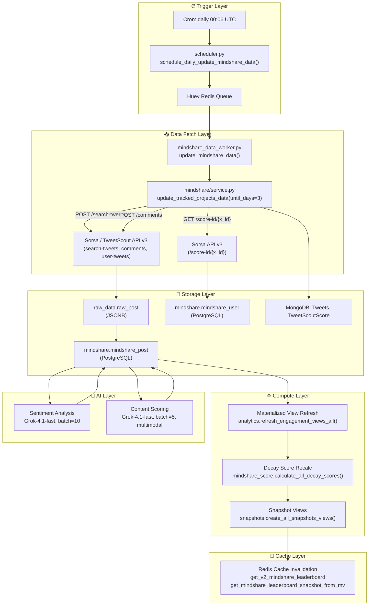

---

## 2. Ingestion Trigger & Scheduling

### Cron Schedule

The entire pipeline is kicked off by a single Huey periodic task defined in [`app/worker/scheduler.py`](../app/worker/scheduler.py):

```python
@huey.periodic_task(
    crontab(minute="06", hour="00")  # Daily at 00:06 UTC
)
def schedule_daily_update_mindshare_data():
    tasks.daily_update_mindshare_data_task.call_local()
```

Huey runs as a separate process (`huey_consumer.py`) with 4 threads, backed by Redis. Tasks survive worker restarts because they persist in the Redis queue.

### Task Chain

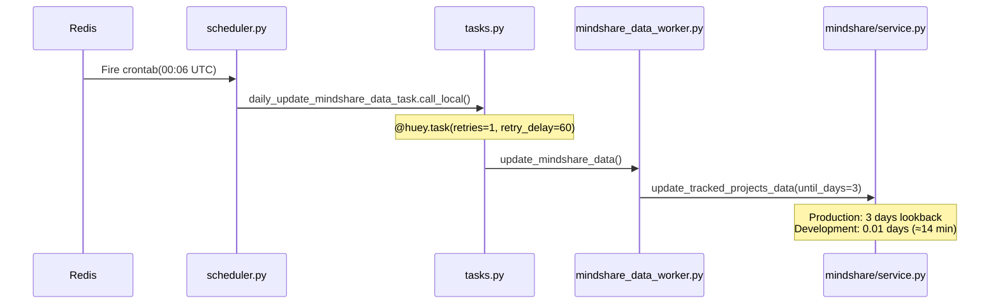

### Environment Branching

The lookback window is environment-sensitive ([`app/worker/mindshare_data_worker.py:386-391`](../app/worker/mindshare_data_worker.py)):

```python
if CONFIG.ENABLE_TRACKED_PROJECTS_UPDATE and CONFIG.ENVIRONMENT == Environments.DEVELOPMENT:
    await update_tracked_projects_data(0.01)   # ~14 minutes for fast local testing
elif CONFIG.ENABLE_TRACKED_PROJECTS_UPDATE:
    await update_tracked_projects_data(3)       # 3 calendar days in production
```

### Feature Flags

All three major phases can be independently disabled:

| Flag | Default | Effect when `False` |
|---|---|---|
| `ENABLE_TRACKED_PROJECTS_UPDATE` | `True` | Skips all API calls and DB ingestion |
| `ENABLE_SENTIMENT_ANALYSIS` | `True` | Skips LLM sentiment scoring |
| `ENABLE_RELEVANCY_SCORING` | `True` | Skips LLM content scoring |

---

## 3. Sorsa / TweetScout API Integration

### API Roots

Two base URLs are involved. Both authenticate with the same `TWEETSCOUT_API_KEY`, passed as the `ApiKey` HTTP header.

| Config Key | Base URL | Purpose |
|---|---|---|
| `TWEETSCOUT_BASE_URL` | Configured externally | Tweet search, replies, user-tweets |
| `SORSA_BASE_URL` | `https://api.sorsa.io/v3` | User influence scores |

!!! info "v3 Migration"
    The codebase migrated from TweetScout v2 to Sorsa v3 in April 2026 (commit `e46092d`). Many field names changed — see the [Data Transformation](#5-data-transformation) section for the full mapping.

### Endpoints

All tweet endpoints are implemented in [`app/modules/tweetscout/third_party_tools/tweetscout_api.py`](../app/modules/tweetscout/third_party_tools/tweetscout_api.py).

#### `POST /search-tweets` — Keyword Search

```python
async def get_tweets_by_keyword(
    tweet_query: str, cursor: str | None
) -> Tuple[List[Dict], str | None]:
```

| Parameter | Type | Value |
|---|---|---|
| `query` | string | Project keyword (e.g. `"Acurast"`) |
| `order` | string | `"latest"` — newest first |
| `next_cursor` | string | Pagination cursor (omitted on first page) |

Returns `(tweets[], next_cursor)`. Timeout: **30 s**.

#### `POST /comments` — Reply Thread Fetch

```python
async def get_tweetscouts_replies(
    tweet_query: str, tweet_link: str, cursor: str | None
) -> Tuple[List[Dict], str | None]:
```

| Parameter | Type | Value |
|---|---|---|
| `tweet_link` | string | Full URL of the parent tweet |
| `next_cursor` | string | Pagination cursor |

Returns `(tweets[], next_cursor)`. Timeout: **30 s**.

#### `POST /user-tweets` — Per-User Timeline

Used for syncing tracked project team members (KOLs). Timeout: **30 s**.

| Parameter | Type | Value |
|---|---|---|
| `user_id` | string | X user ID |
| `next_cursor` | string | Pagination cursor |

#### `GET /score-id/{x_id}` — User Influence Score

```python
async def request_tweetscout_profile(x_id: str) -> dict:
    url = f"{CONFIG.TWEETSCOUT_BASE_URL}/score-id/{x_id}"
```

Returns user profile with Sorsa influence score. Timeout: **90 s**. Gracefully handles `"User not found"` and protected accounts by returning `score: 0`.

### 3-Day Fetch Window

The cutoff date is computed in [`app/modules/mindshare/service.py:302`](../app/modules/mindshare/service.py):

```python
now_utc = datetime.now(timezone.utc)
cutoff_date = now_utc - timedelta(days=until_days)   # until_days=3 in prod

await store_project_tweets_replies_and_users(word, cutoff_date, now_utc)
```

The API is paginated newest-first. The pagination loop reads cursor pages until the **oldest tweet in a batch** is older than `cutoff_date`. This guarantees all tweets within the window are captured even if the API returns them out of order.

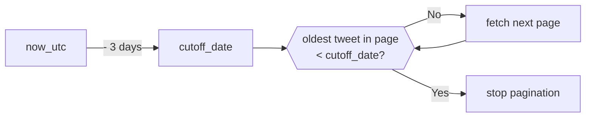

---

## 4. Full Ingestion Flow

This sequence diagram shows one project's complete ingestion run from scheduler trigger to final database commit.

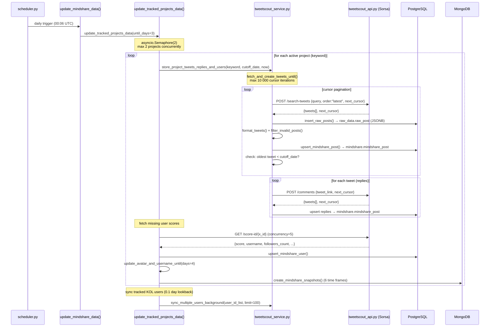

### Concurrency Model

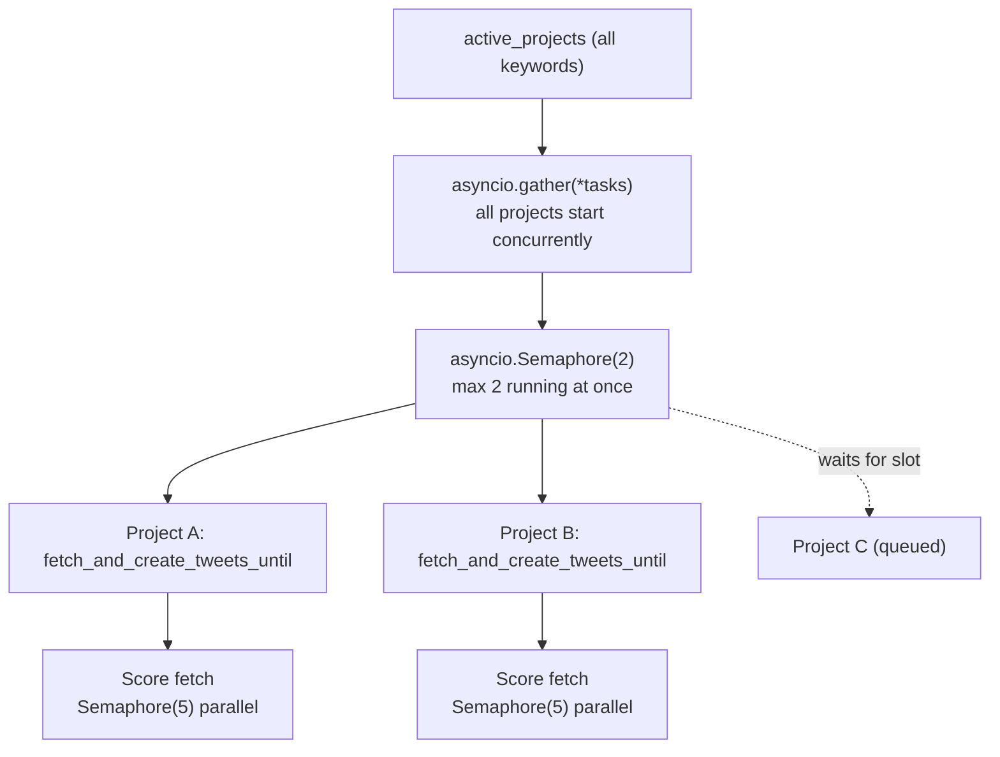

---

## 5. Data Transformation

### Sorsa v3 Field Mapping

The v3 API (Sorsa) changed many field names from the legacy TweetScout v2 format. The formatter in [`app/modules/tweetscout/crud.py`](../app/modules/tweetscout/crud.py) handles this:

| v2 Field | v3 Field (Sorsa) | PostgreSQL Column |
|---|---|---|
| `id_str` | `id` | `post_id` |
| `user.id_str` | `user.id` | `user_x_id` |
| `user.screen_name` | `user.username` | `user_x_username` |
| `user.name` | `user.display_name` | `user_x_display_name` |
| `user.avatar` | `user.profile_image_url` | `user_x_avatar_url` |
| `favorite_count` | `likes_count` | `favorite_count` |
| `in_reply_to_status_id_str` | `in_reply_to_tweet_id` | `replied_post_id` |
| `retweeted_status.id_str` | `retweeted_status.id` | `retweeted_post_id` |
| `quoted_status.id_str` | `quoted_status.id` | `quoted_post_id` |

### Raw API Response Shape (Sorsa v3)

```json
{
  "id": "1234567890",
  "created_at": "2026-05-07T10:30:00Z",
  "full_text": "Tweet content here",
  "reply_count": 5,
  "retweet_count": 10,
  "quote_count": 2,
  "likes_count": 50,
  "view_count": 1200,
  "in_reply_to_tweet_id": "9876543210",
  "retweeted_status": { "id": "..." },
  "quoted_status": { "id": "..." },
  "entities": { "media": [...], "urls": [...] },
  "user": {
    "id": "user_id_string",
    "username": "handle",
    "display_name": "Full Name",
    "profile_image_url": "https://pbs.twimg.com/...",
    "followers_count": 1000
  }
}
```

### Transformation Pipeline

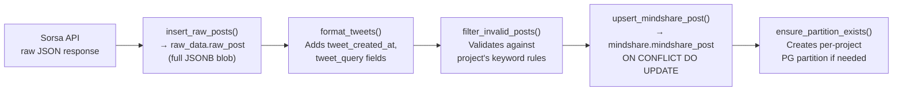

### `mindshare.mindshare_post` Schema (Key Columns)

| Column | Source | Notes |
|---|---|---|
| `post_id` | `tweet.id` | PK (with `post_created_at`) |
| `project_keyword` | `tweet_query` | Partition key |
| `post_created_at` | `tweet.created_at` | PK component |
| `full_text` | `tweet.full_text` | Raw tweet text |
| `user_x_id` | `tweet.user.id` | FK → `mindshare_user` |
| `view_count` | `tweet.view_count` | |
| `favorite_count` | `tweet.likes_count` | v3 rename |
| `retweet_count` | `tweet.retweet_count` | |
| `reply_count` | `tweet.reply_count` | |
| `entities` | `tweet.entities` | JSONB, used for image extraction |
| `is_reply` | computed | `in_reply_to_tweet_id IS NOT NULL` |
| `is_retweet` | computed | `retweeted_status IS NOT NULL` |
| `sentiment_score` | LLM (post-ingestion) | Filled by AI pipeline |
| `content_score` | LLM (post-ingestion) | Filled by AI pipeline |

---

## 6. Error Handling & Retry Strategy

### HTTP-Level Retries

Implemented in [`app/modules/tweetscout/third_party_tools/utils.py`](../app/modules/tweetscout/third_party_tools/utils.py):

- **Max retries**: 3 attempts
- **Retry on**: HTTP 5xx server errors only
- **No retry on**: HTTP 4xx client errors (raised immediately as `HTTPErrorWithData`)
- **Retry delay**: 2 seconds between attempts

### Pagination-Level Retries

Implemented in [`app/modules/tweetscout/tweetscout_service.py:107-221`](../app/modules/tweetscout/tweetscout_service.py):

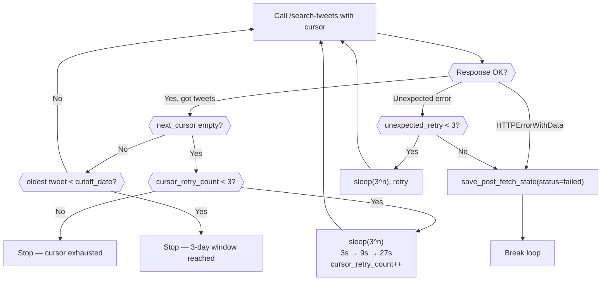

### Task-Level Retries

`daily_update_mindshare_data_task` is configured with `retries=1, retry_delay=60` in [`app/worker/tasks.py`](../app/worker/tasks.py) — the entire pipeline retries once after 60 seconds if it throws an unhandled exception.

---

## 7. Post-Ingestion Processing Pipeline

After raw data is stored, `update_mindshare_data()` continues with four sequential compute steps before AI analysis:

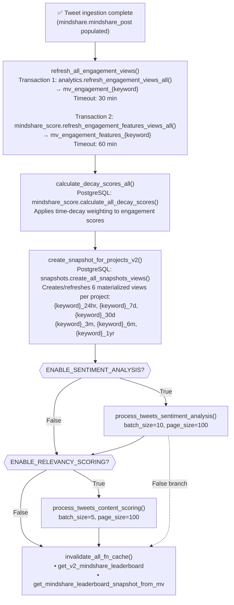

---

## 8. AI Analysis Sub-Pipelines

### 8.1 Sentiment Analysis

**File**: [`app/worker/utils/mindshare_ai_score_worker.py`](../app/worker/utils/mindshare_ai_score_worker.py)

Targets all posts where `sentiment_score IS NULL AND is_reply=False AND is_retweet=False`.

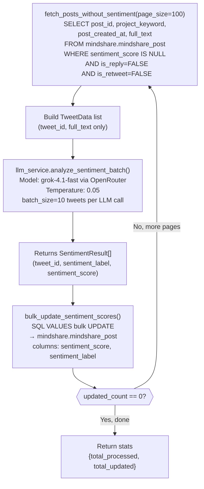

**Output labels**: `positive`, `negative`, `neutral` with a confidence score `0.0–1.0`.

### 8.2 Content Scoring

**File**: [`app/worker/utils/mindshare_ai_score_worker.py`](../app/worker/utils/mindshare_ai_score_worker.py)

Targets all posts where `content_score IS NULL AND is_retweet=False AND is_reply=False`. Projects in the exclusion list (`IronAllies_`, `_technotainment`, `D3lMundos`, `Pact_Swap`, `Acurast`, `YOM_Official`) are skipped.

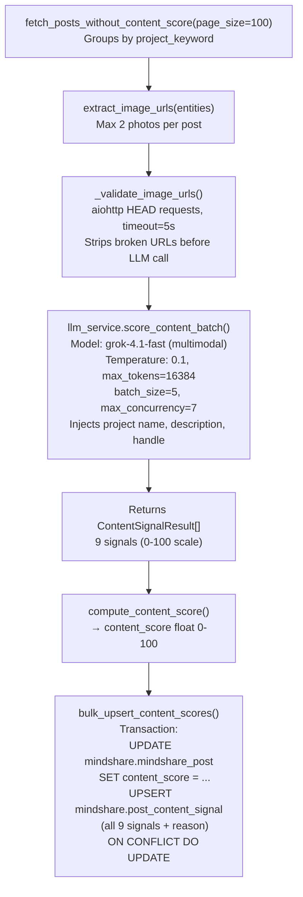

### 8.3 Content Score Algorithm

Implemented in [`app/worker/utils/content_score.py`](../app/worker/utils/content_score.py).

**Inputs** (all 0–100 unless noted):

| Signal | Description |
|---|---|
| `relevance` | How directly the tweet discusses the project |
| `context_depth` | Informational or analytical substance |
| `meme_communication_value` | How well a meme communicates about the project |
| `visual_information_density` | Concrete project info in images |
| `human_signal` | Genuine expression vs. templated promotion |
| `project_mentions` | Count of crypto projects mentioned (raw count, not 0-100) |
| `mention_farming_risk` | Likelihood tweet exists purely to farm tags |
| `ai_generated_probability` | Likelihood text is AI-generated |
| `sentiment` | -1 to 1 (separate from scoring pipeline) |

**Algorithm (6 steps)**:

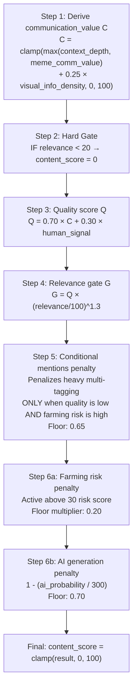

**`post_content_signal` table** stores all 9 raw signals plus the LLM's `reason` text, enabling score debugging and recomputation without re-calling the LLM.

---

## 9. S3 Backfill Path (Alternative Ingestion)

In addition to the live API path, an alternative ingestion route reads historical data from S3 Parquet files.

**File**: [`app/worker/athena_ingestion_worker.py`](../app/worker/athena_ingestion_worker.py)  
**Task**: `s3_tweets_ingestion_task(user_id=None, fetch_all=False)` in [`app/worker/tasks.py`](../app/worker/tasks.py)

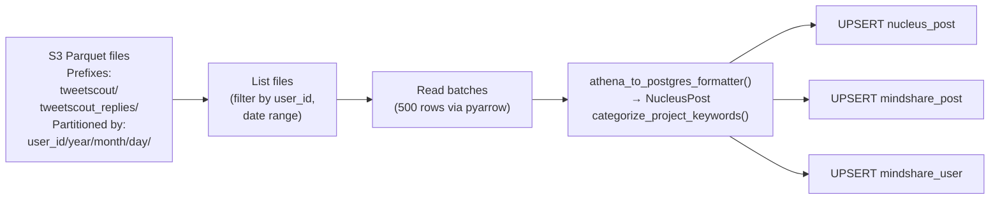

This path is triggered manually or via `s3_tweets_ingestion_task` — it is **not** part of the daily scheduled run.

---

## 10. Configuration Reference

All environment variables are defined in [`app/config.py`](../app/config.py) as a Pydantic `EnvConfig` model.

### API Keys & External Services

| Variable | Required | Description |
|---|---|---|
| `TWEETSCOUT_BASE_URL` | Yes | Base URL for Sorsa/TweetScout tweet search endpoints |
| `TWEETSCOUT_API_KEY` | Yes | API key for all TweetScout/Sorsa endpoints |
| `SORSA_BASE_URL` | Yes | `https://api.sorsa.io/v3` — Sorsa score endpoint base |
| `OPENROUTER_API_KEY` | Yes | LiteLLM key for Grok-4.1-fast via OpenRouter |
| `COOKIE3_API_KEY` | No | On-chain data provider |
| `SNAG_API_KEY` | No | Loyalty platform sync |

### Databases

| Variable | Required | Description |
|---|---|---|
| `DATABASE_URL` | Yes | MongoDB connection string |
| `POSTGRES_DATABASE_URL` | Yes | PostgreSQL async connection string |
| `REDIS_URL` | Yes | Redis URL for Huey task queue and response cache |
| `DATABASE_NAME` | Yes | MongoDB database name |

### AWS / S3

| Variable | Required | Description |
|---|---|---|
| `AWS_ACCESS_KEY_ID` | For S3 | AWS credentials |
| `AWS_SECRET_ACCESS_KEY` | For S3 | AWS credentials |
| `AWS_REGION` | For S3 | AWS region |
| `S3_BUCKET` | For S3 | General data lake bucket |
| `TWEETS_S3_BUCKET` | For S3 | Tweet archive bucket |

### Feature Flags

| Variable | Default | Description |
|---|---|---|
| `ENABLE_TRACKED_PROJECTS_UPDATE` | `True` | Enable live API ingestion |
| `ENABLE_SENTIMENT_ANALYSIS` | `True` | Enable LLM sentiment scoring |
| `ENABLE_RELEVANCY_SCORING` | `True` | Enable LLM content scoring |
| `ENVIRONMENT` | `production` | Controls 3-day vs 0.01-day window |
| `RATE_LIMIT_EXEMPT_KEYS` | `[]` | API keys exempt from rate limiting |

---

## 11. Key Files Reference

| File | Purpose | Key Functions / Classes |
|---|---|---|
| [`app/worker/scheduler.py`](../app/worker/scheduler.py) | Cron schedule definition | `schedule_daily_update_mindshare_data()` |
| [`app/worker/tasks.py`](../app/worker/tasks.py) | Huey task wrappers with retry config | `daily_update_mindshare_data_task()`, `s3_tweets_ingestion_task()` |
| [`app/worker/huey_config.py`](../app/worker/huey_config.py) | Redis-backed Huey instance | `huey` (RedisHuey) |
| [`app/worker/mindshare_data_worker.py`](../app/worker/mindshare_data_worker.py) | Main pipeline orchestration | `update_mindshare_data()` |
| [`app/modules/mindshare/service.py`](../app/modules/mindshare/service.py) | Project-level ingestion logic | `update_tracked_projects_data()`, `create_snapshot_for_projects_v2()` |
| [`app/modules/tweetscout/tweetscout_service.py`](../app/modules/tweetscout/tweetscout_service.py) | Pagination loop, score concurrency | `fetch_and_create_tweets_until()`, `create_tweetscout_scores_in_parallel()` |
| [`app/modules/tweetscout/third_party_tools/tweetscout_api.py`](../app/modules/tweetscout/third_party_tools/tweetscout_api.py) | Sorsa HTTP API client | `get_tweets_by_keyword()`, `get_tweetscouts_replies()`, `request_tweetscout_profile()` |
| [`app/modules/tweetscout/tweetscout.py`](../app/modules/tweetscout/tweetscout.py) | Fetch → raw store → format → upsert | `fetch_and_create_tweetscout_tweets()`, `retry_fetch_tweets()` |
| [`app/modules/tweetscout/crud.py`](../app/modules/tweetscout/crud.py) | PostgreSQL CRUD for posts/users | `upsert_mindshare_post()`, `insert_raw_posts()` |
| [`app/modules/mindshare_analytics/service.py`](../app/modules/mindshare_analytics/service.py) | Materialized view refresh, decay scores | `refresh_all_engagement_views()`, `calculate_decay_scores_all()` |
| [`app/worker/utils/mindshare_ai_score_worker.py`](../app/worker/utils/mindshare_ai_score_worker.py) | LLM sentiment & content scoring workers | `process_tweets_sentiment_analysis()`, `process_tweets_content_scoring()` |
| [`app/worker/utils/llm_service.py`](../app/worker/utils/llm_service.py) | LiteLLM integration | `LLMService`, `analyze_sentiment_batch()`, `score_content_batch()` |
| [`app/worker/utils/content_score.py`](../app/worker/utils/content_score.py) | Deterministic score formula | `compute_content_score()`, `ContentScoreConfig` |
| [`app/worker/athena_ingestion_worker.py`](../app/worker/athena_ingestion_worker.py) | S3 Parquet backfill path | `ingest_s3_tweets_data()` |
| [`app/config.py`](../app/config.py) | All environment configuration | `EnvConfig`, `CONFIG` |

---

## 12. End-to-End Data Lifecycle Summary

```mermaid
timeline
    title Daily Pipeline Timeline (approximate, production)
    00:06 : Cron fires
           : Huey dequeues task
    00:06 - ~02:00 : Live API ingestion per project
                   : Sorsa /search-tweets (cursor pages until 3-day cutoff)
                   : Sorsa /comments for reply threads
                   : User score fetch via /score-id
                   : raw_data.raw_post written
                   : mindshare.mindshare_post upserted
                   : MongoDB snapshots created
    ~02:00 - ~04:00 : Engagement view refresh
                    : mv_engagement_{keyword} refreshed
                    : mv_engagement_features_{keyword} refreshed
    ~04:00 : Decay score recalculation
           : All project leaderboards updated
           : Snapshot materialized views created
    ~04:00 onwards : LLM Sentiment Analysis
                   : Grok-4.1-fast, batch 10, paginated
    Ongoing : LLM Content Scoring
            : Grok-4.1-fast, batch 5, multimodal
            : 9 signals → content_score
    End : Redis cache invalidated
        : Leaderboard APIs serve fresh data
```

---

!!! tip "Debugging a Data Gap"
    If a project's leaderboard looks stale:

    1. Check `raw_data.raw_post` for recent rows with that `project_keyword` — confirms whether the API call succeeded.
    2. Query `mindshare.mindshare_post WHERE project_keyword = '...' ORDER BY post_created_at DESC LIMIT 10` — confirms transform and upsert.
    3. Check `PostFetchState` in MongoDB for `fetch_status = 'failed'` — records cursor + timestamp of the last failed fetch.
    4. Verify `ENABLE_TRACKED_PROJECTS_UPDATE=True` in the running environment.
    5. Check Huey worker logs for `HTTPErrorWithData` or unexpected error messages around 00:06 UTC.
