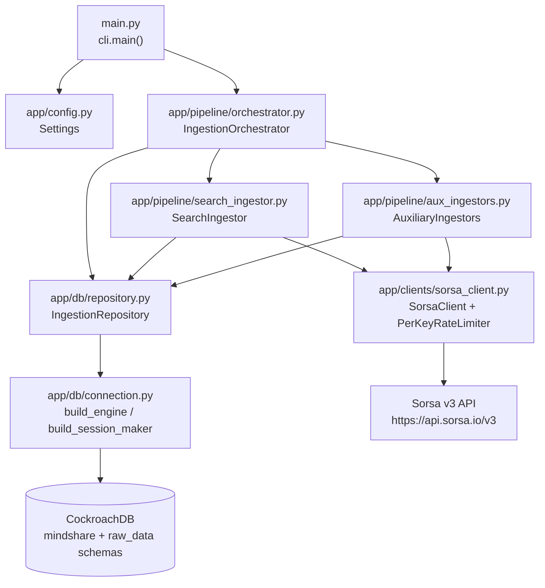

# Architecture

This page documents every module in `app/`, its responsibilities, its internal design decisions, and how it connects to the rest of the system.

---

## System overview



---

## Module-by-module breakdown

### `main.py`

The Python entry point. Contains only:

```python
from app.cli import main
if __name__ == "__main__":
    main()
```

No business logic. Exists purely to allow `python main.py` invocation from the repo root.

---

### `app/cli.py` — CLI entrypoint

**Responsibility:** parse CLI arguments, bootstrap the runtime environment, drive the async orchestrator.

**How it works:**

1. Defines `main()` which creates an `argparse.ArgumentParser` with:
   - `--project-keyword` (required, single string) — one keyword or a comma-separated list of aliases (e.g. `"quipnetwork,Quip Network,quip_network"`).
   - `--hours N` (optional, default 72) — lookback window.
2. Calls `asyncio.run(_run(project_keyword, hours))` to enter the async event loop.
3. Inside `_run`, calls `_configure_logging()` first — sets up `logging.basicConfig` with `INFO` level and a timestamped format (`%(asctime)s [%(levelname)s] %(name)s: %(message)s`). This makes all `logger.info/error` calls in `orchestrator.py` and `sorsa_client.py` visible on stdout.
4. Calls `load_dotenv()` — reads `.env` from the working directory before `Settings` instantiation.
5. Instantiates `Settings()` which binds all env vars via Pydantic-settings.
6. Constructs `IngestionOrchestrator(settings)`.
7. Awaits `orchestrator.run_project_ingestion(project_keyword, hours=hours)`.
8. In a `finally` block, always calls `orchestrator.close()` to dispose the SQLAlchemy engine and release DB connections.

**Multi-keyword support:** The comma-separated string is passed directly to the Sorsa API as the query (Sorsa handles multi-term matching internally). The orchestrator splits on commas only to derive `project_label = terms[0]` for DB storage. No query transformation happens in the pipeline.

**Worker portability:** A background worker can skip the CLI layer entirely and call `IngestionOrchestrator.run_project_ingestion("Acurast")` directly after constructing an orchestrator with a `Settings` instance. No CLI assumptions leak into the pipeline.

---

### `app/config.py` — Settings

**Responsibility:** central, validated, typed configuration loaded from environment variables.

**Implementation:** extends `pydantic_settings.BaseSettings` with `SettingsConfigDict`:
- `env_file = ".env"` — reads `.env` automatically (but `cli.py` calls `load_dotenv()` first for explicit control).
- `env_file_encoding = "utf-8"`
- `extra = "ignore"` — silently ignores unknown env vars.

**Fields:**

| Field | Env var | Default | Type |
|---|---|---|---|
| `cockroach_database_url` | `COCKROACH_DATABASE_URL` | required | `str` |
| `sorsa_base_url` | `SORSA_BASE_URL` | `https://api.sorsa.io/v3` | `str` |
| `sorsa_api_key` | `SORSA_API_KEY` | required | `str` |
| `sorsa_per_key_rps` | `SORSA_PER_KEY_RPS` | `20` | `int` |
| `search_slice_count` | `SEARCH_SLICE_COUNT` | `20` | `int` |
| `search_max_concurrency` | `SEARCH_MAX_CONCURRENCY` | `20` | `int` |
| `search_order` | `SEARCH_ORDER` | `"latest"` | `str` |
| `max_retries` | `SORSA_MAX_RETRIES` | `4` | `int` |
| `retry_429_sleep_seconds` | `SORSA_RETRY_429_SLEEP_SECONDS` | `1.0` | `float` |
| `retry_5xx_sleep_seconds` | `SORSA_RETRY_5XX_SLEEP_SECONDS` | `2.0` | `float` |

**`api_keys` property:** returns `[self.sorsa_api_key.strip()]` — a single-element list. The orchestrator iterates this list using round-robin index assignment (`key_idx % len(keys)`), so the design is already multi-key capable; the config just doesn't expose comma-separated parsing yet.

---

### `app/models.py` — Shared dataclasses

**`TimeSlice`** — frozen dataclass representing one time-window segment assigned to an API key:

| Field | Type | Description |
|---|---|---|
| `slice_id` | `int` | 1-based index |
| `since` | `datetime` | Start of this slice (UTC) |
| `until` | `datetime` | End of this slice (UTC) |
| `api_key_alias` | `str` | Which key alias is assigned to this slice |

Used by `build_time_slices()` in `search_ingestor.py` and consumed by `SearchIngestor._ingest_slice()`.

**`IngestionContext`** — mutable dataclass holding run metadata (run_id, project_keyword, slice_id, endpoint, api_key_alias). Currently unused in running code — reserved for future structured context propagation.

**`JsonDict`** — type alias for `dict[str, Any]`.

---

### `app/clients/sorsa_client.py` — HTTP client

**Responsibility:** all communication with the Sorsa v3 REST API — rate limiting, retrying, authentication.

#### `PerKeyRateLimiter`

Enforces a maximum of **`rps` requests per second** per API key alias. The Sorsa API allows a flat `SORSA_PER_KEY_RPS` requests every second (default: 20).

Implementation:
- Maintains a `deque[float]` of event timestamps for each alias, keyed by `alias` string.
- `acquire(alias)` is an async method that:
  1. Locks (`asyncio.Lock`) and trims timestamps older than 1 second from the front of the deque.
  2. If the deque length is below `rps`, appends the current monotonic time, **increments the request counter for that alias**, and returns — the request may proceed.
  3. Otherwise calculates `sleep_for = 1.0 - (now - q[0])`, releases the lock, and sleeps until the oldest tracked request falls outside the 1-second window.
  4. Loops until a slot is available.
- The lock is released before sleeping so other coroutines are not blocked while waiting.
- `rps` is floored to 1 via `max(1, rps)`.

**Request counter methods:**

| Method | Description |
|---|---|
| `get_counts() -> dict[str, int]` | Returns a snapshot `{alias: total_requests}` for all aliases that have dispatched at least one request. |
| `log_counts(context="")` | Emits an `INFO` log line with the running totals, e.g. `After phase 1: Request counts — total=243 \| key_1=243`. Called by the orchestrator after every phase. |

#### `ApiKeyState`

A simple `@dataclass` holding `alias: str` and `api_key: str`. The alias is used for rate limiter keying and checkpoint labeling.

#### `SorsaClient`

Stateless HTTP call wrapper. Constructor receives the rate limiter (injected), base URL, timeout, and retry config.

**`_request(method, path, key_state, payload)`** — core request method:

1. Calls `self._limiter.acquire(key_state.alias)` before every attempt (including retries).
2. Opens a **fresh `aiohttp.ClientSession` per request** (not per client instance). This avoids connection reuse issues across concurrent coroutines.
3. Sends `ApiKey: <key>` and `Accept: application/json` headers; adds `Content-Type: application/json` for POST.
4. Parses response JSON with `content_type=None` to tolerate non-standard content-type headers.
5. On success (2xx): returns the response dict (or `{}` if the body isn't a dict).
6. On HTTP 429: sleeps `retry_429_sleep_seconds` and retries if attempts remain; raises `SorsaRateLimitError` on final attempt.
7. On HTTP 5xx: sleeps `retry_5xx_sleep_seconds` and retries; raises `SorsaClientError` on final attempt.
8. On `aiohttp.ClientError` or `asyncio.TimeoutError`: sleeps `retry_5xx_sleep_seconds` and retries; raises `SorsaClientError` on final attempt.
9. Falls through to a terminal `raise SorsaClientError("request retries exhausted")` as a safety net.

**Endpoint methods:**

| Method | HTTP | Path | Key params |
|---|---|---|---|
| `search_tweets` | POST | `/search-tweets` | `query` (includes `since:` / `until:` inline), `order`, optional `next_cursor` |
| `comments` | POST | `/comments` | `tweet_link` (post ID as string), optional `next_cursor` |
| `user_tweets` | POST | `/user-tweets` | `user_id`, optional `next_cursor` |
| `score_id` | GET | `/score-id/{x_id}` | path param only |

**`to_sorsa_date(dt)`** — utility function that formats a `datetime` into Sorsa's expected format: `YYYY-MM-DD_HH:MM:SS_UTC`. Called by `SearchIngestor._ingest_slice()` when constructing `since:` / `until:` query clauses.

---

### `app/db/connection.py` — Engine factory

**Responsibility:** create the SQLAlchemy async engine and session factory.

**`build_engine(settings)`:**
- Calls `create_async_engine` with `pool_pre_ping=True`, `pool_size=20`, `max_overflow=10`.
- `pool_pre_ping` ensures stale connections are detected and recycled before use.

**`build_session_maker(engine)`:**
- Returns an `async_sessionmaker[AsyncSession]` with `expire_on_commit=False`.
- `expire_on_commit=False` prevents SQLAlchemy from expiring ORM objects after commit (important for async patterns where lazy loading doesn't work).

Both are called once in `IngestionOrchestrator.__init__` and the session maker is shared across all repository calls for the lifetime of one run.

---

### `app/db/repository.py` — Data access layer

**Responsibility:** all SQL. No business logic; takes validated Python values and executes the correct SQL statement.

Every method opens a fresh `AsyncSession` using `async with self._session_maker() as session`, executes, commits, and closes. The session scope is per-operation (not per run).

#### `create_run(project_keyword, since, until) -> str`

Generates a UUID (`str(uuid4())`), inserts a row into `mindshare.ingestion_run` with `run_status = 'running'` and returns the UUID. Called at the start of every `run_project_ingestion`.

#### `mark_run_finished(run_id, status, error=None)`

Updates `mindshare.ingestion_run` setting `run_status`, `error_summary`, and `finished_at = now()`. Called with `'completed'` on success or `'failed'` with the exception string on any uncaught error.

#### `upsert_mindshare_posts_batch(payloads, project_keyword, run_id)`

The core write method. Normalizes a batch of raw tweet dicts into `mindshare.mindshare_post` in **one transaction**. Filters out rows missing `post_id`, `user_x_id`, or `created_at` before the batch (logs a WARNING per skipped row).

**Batch behaviour:** SQLAlchemy's `session.execute(sql, list_of_dicts)` triggers DBAPI `executemany` under asyncpg — the prepared statement is reused for every row in the list, and all rows are committed in a single transaction.

**Field extraction from the raw payload:**

| DB column | Source in payload |
|---|---|
| `post_id` | `payload["id"]` |
| `user_x_id` | `payload["user"]["id"]` |
| `project_keywords` | `ARRAY[project_keyword]` (merged on conflict — see below) |
| `full_text` | `payload["full_text"]` |
| `retweeted_post_id` | `payload["retweeted_status"]["id"]` |
| `replied_post_id` | `payload["in_reply_to_tweet_id"]` |
| `quoted_post_id` | `payload["quoted_status"]["id"]` |
| `root_post_id` | `payload["conversation_id_str"]` |
| `view_count` | `payload["view_count"]` |
| `reply_count` | `payload["reply_count"]` |
| `retweet_count` | `payload["retweet_count"]` |
| `quote_count` | `payload["quote_count"]` |
| `favorite_count` | `payload["likes_count"]` |
| `entities` | `payload["entities"]` (stored as JSONB) |
| `post_created_at` | `payload["created_at"]` |

Skips rows where `post_id`, `user_x_id`, or `created_at` are missing/empty.

**Conflict resolution on `post_id`:**
- `project_keywords`: merged via `array_agg(DISTINCT k)` over `existing || incoming` — deduplicates, never loses a keyword.
- `full_text`: only replaced if the incoming value is non-empty; preserves existing text otherwise.
- All engagement counts: always overwritten with latest values.
- `retweeted_post_id`, `replied_post_id`, `quoted_post_id`, `root_post_id`, `entities`: use `COALESCE(EXCLUDED, existing)` — keeps the first non-null value.
- `last_seen_at`, `last_ingested_run_id`: always updated to reflect this run.

#### `upsert_window_checkpoint(run_id, project_keyword, window_id, endpoint, api_key_alias, next_cursor, status, error_message=None)`

Single-row write — checkpoints are naturally one per page fetch, so no batching needed.

Upserts into `mindshare.ingestion_window_checkpoint`. Conflict key is `(run_id, project_keyword, window_id, endpoint)`. On conflict, updates `api_key_alias`, `next_cursor`, `status`, `error_message`, and `updated_at`. This is called after every page fetch to maintain a recoverable cursor.

#### `upsert_user_score(x_id, username, display_name, avatar_url, followers_count, score)`

Upserts into `mindshare.mindshare_user`. Conflict key is `x_id`. On conflict, updates `x_username`, `display_name`, `score`, `avatar_url`, `followers_count`, `last_score_fetched_at`, and `updated_at` — using `COALESCE(NULLIF(EXCLUDED.field, ''), existing)` so empty strings don't clobber non-empty stored values.

---

### `app/pipeline/search_ingestor.py` — Phase 1

**Responsibility:** ingest all tweets matching the keyword from the last 72 hours.

#### `build_time_slices(since, until, slice_count, keys) -> list[TimeSlice]`

Module-level function. Divides `[since, until]` into `slice_count` equal sub-windows. Each slice is assigned an API key alias by round-robin: `keys[i % len(keys)].alias`. The last slice always ends exactly at `until` to avoid floating-point drift.

Example with `slice_count=3` over 72 hours and one key:

```
slice_1: t+0h   → t+24h  (key_1)
slice_2: t+24h  → t+48h  (key_1)
slice_3: t+48h  → t+72h  (key_1)
```

#### `SearchIngestor.ingest_window(project_keyword, search_query, ...) -> tuple[set[str], set[str]]`

Returns `(all_post_ids, all_user_ids)` — the union of every post ID and user ID seen across all slices.

- `project_keyword` — the DB label (first term, stored in `ingestion_run` and `mindshare_post.project_keywords`).
- `search_query` — the OR-joined query string sent to Sorsa.

1. Computes `until = now()`, `since = until - hours`.
2. Calls `build_time_slices()` to get the slice list.
3. Builds a `key_map: {alias -> ApiKeyState}` for O(1) lookup during slice execution.
4. Computes `effective_concurrency = max(1, min(slice_count, max_concurrency, per_key_rps))`.
5. Creates `asyncio.Semaphore(effective_concurrency)`.
6. Launches all slice coroutines as tasks via `asyncio.gather(*tasks)`. Each coroutine acquires the semaphore before calling `_ingest_slice`.
7. Merges results across all slices with `set.update()`.

#### `SearchIngestor._ingest_slice(project_keyword, search_query, ...) -> tuple[set[str], set[str]]`

Runs the paginated fetch loop for one time slice:

1. Sets `window_id = f"slice_{slice_.slice_id}"`.
2. Loops: calls `client.search_tweets(query=search_query, ...)` with formatted since/until timestamps.
3. Accumulates returned tweets into an in-memory `buffer`. When `len(buffer) >= batch_size`, calls `_write_batch()` to upsert to `mindshare_post` using `project_keyword` as the DB label.
4. Reads `data.get("next_cursor")`. If present: calls `repo.upsert_window_checkpoint(status="running")` and loops. If absent: calls `repo.upsert_window_checkpoint(status="completed")` and breaks.
5. After the loop, any remaining records in the buffer (< `batch_size`) are written as the final batch.
6. On any exception: calls `repo.upsert_window_checkpoint(status="failed", error_message=str(exc))` and re-raises. The semaphore is released when the coroutine exits, allowing another slice to start.

---

### `app/pipeline/aux_ingestors.py` — Phases 2–4

**Responsibility:** sequential ingestion of comments, user timelines, and user scores for all IDs discovered in Phase 1.

All three methods receive `run_id`, `project_keyword`, and `key: ApiKeyState` — they use only the first available key (passed by the orchestrator).

#### `ingest_comments_for_posts(posts, key, ...)`

For each `post_id` in `posts`:
- `window_id = f"comments_{post_id}"`
- Paginated loop: calls `client.comments(tweet_link=post_id, cursor=cursor)`.
- Each returned tweet is upserted raw and normalized (same calls as the search phase).
- Checkpoint written with `status="running"` (cursor present) or `"completed"` (no cursor).
- On exception: checkpoint written with `status="failed"` and `error_message`; loop breaks (`continue` to next post rather than propagating). This means a single failed post doesn't abort the whole comments phase.

#### `ingest_user_tweets(user_ids, key, ...)`

Same pattern as comments but for user timelines:
- `window_id = f"user_{user_id}"`
- Calls `client.user_tweets(user_id=user_id, cursor=cursor)`.
- Same raw + normalized upsert + checkpoint pattern.
- Per-user errors are silently caught and checkpointed as `failed`; iteration continues.

#### `ingest_scores(user_ids, key, ...)`

Scores are not paginated — one GET per user:
- `window_id = f"score_{user_id}"`
- Calls `client.score_id(x_id=user_id)`.
- Calls `repo.upsert_user_score()` with `username`, `display_name`, `profile_image_url`, `followers_count`, `score` extracted from the response.
- Writes checkpoint with `status="completed"` or `"failed"`.
- Per-user errors are caught (not re-raised) — other users are still scored.

---

### `app/pipeline/orchestrator.py` — Top-level coordinator

**Responsibility:** wire all components together, control phase order, own the run lifecycle.

**`__init__(settings)`:**
- Creates engine and session maker via `connection.py`.
- Creates `IngestionRepository`.
- Creates `PerKeyRateLimiter(settings.sorsa_per_key_rps)` and stores it as `self._limiter` so request counts are accessible throughout the run.
- Creates `SorsaClient` with all retry/timeout/limiter config.
- Creates `SearchIngestor(repo, client)` and `AuxiliaryIngestors(repo, client)`.

**`_api_keys()`:**
Converts `settings.api_keys` (a list of key strings) into `list[ApiKeyState]` with auto-generated aliases `key_1`, `key_2`, etc.

**`run_project_ingestion(project_keyword: str, hours: int = 72) -> str`:**

Splits `project_keyword` on commas to derive:
- `project_label = terms[0]` — stored in the DB as the project identifier (`ingestion_run`, `mindshare_post.project_keywords`).
- `search_query = project_keyword` — the full original string sent unchanged to the Sorsa API (Sorsa handles comma-separated multi-term matching internally).

```
logger.info("Starting ingestion — label=... query=... window=... → ...")
run_id = repo.create_run(project_keyword=project_label, ...)
logger.info("Run created — run_id=...")
try:
    logger.info("Phase 1 — search starting")
    post_ids, user_ids = search_ingestor.ingest_window(project_keyword=project_label, search_query=search_query, ...)
    logger.info("Phase 1 complete — posts_found=N users_found=M")
    limiter.log_counts("After phase 1:")       # e.g. "total=243 | key_1=243"

    logger.info("Phase 2 — comments starting — posts=N")
    aux_ingestors.ingest_comments_for_posts(...)
    limiter.log_counts("After phase 2:")

    logger.info("Phase 3 — user timelines starting — users=M")
    aux_ingestors.ingest_user_tweets(...)
    limiter.log_counts("After phase 3:")

    logger.info("Phase 4 — user scores starting — users=M")
    aux_ingestors.ingest_scores(...)
    limiter.log_counts("After phase 4:")

    repo.mark_run_finished(run_id, "completed")
    limiter.log_counts("Final totals:")
    logger.info("Ingestion completed — run_id=...")
    return run_id
except Exception as exc:
    repo.mark_run_finished(run_id, "failed", str(exc))
    limiter.log_counts("Counts at failure:")
    logger.error("Ingestion failed — run_id=... error=...")
    raise
```

Any uncaught exception from `SearchIngestor` (which re-raises slice failures) will abort aux phases, mark the run `failed`, log counts at the point of failure, and propagate to the CLI.

Note: aux phase errors per-post/user are **not** re-raised (swallowed in `AuxiliaryIngestors`), so they don't abort the run.

**`close()`:**
Disposes the SQLAlchemy engine (closes all DB connections). Called in `cli.py`'s `finally` block.

---

## Dependency injection summary

All dependencies flow from `IngestionOrchestrator.__init__` downward — no singleton globals, no module-level state (except `asyncio.Lock` inside `PerKeyRateLimiter`, which is instance-scoped):

```
Settings
  └── IngestionOrchestrator
        ├── build_engine → AsyncEngine
        │     └── build_session_maker → async_sessionmaker
        │           └── IngestionRepository
        ├── PerKeyRateLimiter
        │     └── SorsaClient
        ├── SearchIngestor(repo, client)
        └── AuxiliaryIngestors(repo, client)
```

---

## Concurrency model

- Phase 1 (search) is **concurrent** — `asyncio.gather` runs all slice coroutines in the same event loop, bounded by a semaphore.
- Phases 2–4 (comments, user-tweets, scores) are **sequential** — each phase iterates its input set with a plain `for` loop and `await`.
- All I/O (HTTP and DB) is async throughout — no blocking calls on the event loop thread.
- The rate limiter uses a single `asyncio.Lock` to serialize timestamp deque updates; it does **not** block the event loop while sleeping (it `await asyncio.sleep()`s).
