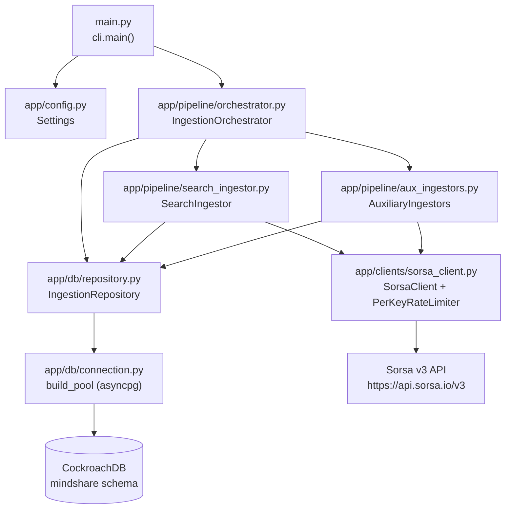

# Architecture

This page documents every module in `app/`, its responsibilities, internal design decisions, and how it connects to the rest of the system.

---

## System overview



---

## Module-by-module breakdown

### `main.py`

The Python entry point. Contains only:

```python
from app.cli import main
if __name__ == "__main__":
    main()
```

No business logic. Exists purely to allow `python main.py` invocation from the repo root.

---

### `app/cli.py` — CLI entrypoint

**Responsibility:** parse CLI arguments, bootstrap the runtime environment, drive the async orchestrator, record total elapsed time.

**How it works:**

1. Defines `main()` which creates an `argparse.ArgumentParser` with:
   - `--project-keyword` (required) — one keyword or a comma-separated list of aliases (e.g. `"quipnetwork,Quip Network,quip_network"`).
   - `--hours N` (optional, default 72) — lookback window in hours. Mutually exclusive with `--since`.
   - `--since DATETIME` (optional) — explicit UTC start of the search window. Mutually exclusive with `--hours`.
   - `--until DATETIME` (optional) — explicit UTC end of the search window. Defaults to now when `--since` is used.
2. `_parse_datetime_arg(value)` — parses user-supplied datetime strings into UTC-aware `datetime` objects. Accepts formats: `YYYY-MM-DD`, `YYYY-MM-DD HH:MM`, `YYYY-MM-DD HH:MM:SS`.
3. Calls `asyncio.run(_run(...))` to enter the async event loop.
4. Inside `_run`, calls `_configure_logging()` first — sets up console and file logging. Creates `logs/YYYY-MM-DD/run_HHMMSS_<8-char-uuid>.log` for each run. Returns the log file path which is immediately logged.
5. Calls `load_dotenv()` — reads `.env` from the working directory before `Settings` instantiation.
6. Instantiates `Settings()` which binds all env vars via Pydantic-settings.
7. Calls `build_pool(settings)` to create an `asyncpg.Pool`.
8. Constructs `IngestionOrchestrator(settings, pool)`.
9. Records `pipeline_start = datetime.now(timezone.utc)`.
10. Awaits `orchestrator.run_project_ingestion(project_keyword, hours, since, until)`.
11. On completion, logs total elapsed time: `elapsed=19.7 min (19m 42s)`.
12. In a `finally` block, always calls `orchestrator.close()` to release DB connections.

**Log file location:** `logs/YYYY-MM-DD/run_HHMMSS_<uuid8>.log` — created at the start of every run. Both `INFO` and `WARNING`/`ERROR` go to both console and file.

---

### `app/config.py` — Settings

**Responsibility:** central, validated, typed configuration loaded from environment variables.

**Implementation:** extends `pydantic_settings.BaseSettings` with `SettingsConfigDict`:
- `env_file = ".env"` — reads `.env` automatically.
- `env_file_encoding = "utf-8"`
- `extra = "ignore"` — silently ignores unknown env vars.

**Fields:**

| Field | Env var | Default | Type |
|---|---|---|---|
| `cockroach_database_url` | `COCKROACH_DATABASE_URL` | required | `str` |
| `sorsa_base_url` | `SORSA_BASE_URL` | `https://api.sorsa.io/v3` | `str` |
| `sorsa_api_keys` | `SORSA_API_KEYS` | required | `str` (comma-separated) |
| `sorsa_per_key_rps` | `SORSA_PER_KEY_RPS` | `20` | `int` |
| `search_slice_count` | `SEARCH_SLICE_COUNT` | `20` | `int` |
| `search_max_concurrency_override` | `SEARCH_MAX_CONCURRENCY` | `None` | `int \| None` |
| `aux_max_concurrency_override` | `AUX_MAX_CONCURRENCY` | `None` | `int \| None` |
| `search_order` | `SEARCH_ORDER` | `"latest"` | `str` |
| `max_retries` | `SORSA_MAX_RETRIES` | `4` | `int` |
| `retry_429_sleep_seconds` | `SORSA_RETRY_429_SLEEP_SECONDS` | `1.0` | `float` |
| `retry_5xx_sleep_seconds` | `SORSA_RETRY_5XX_SLEEP_SECONDS` | `2.0` | `float` |
| `db_write_batch_size` | `DB_WRITE_BATCH_SIZE` | `1000` | `int` |

**Computed properties:**

- **`asyncpg_dsn`** — strips the `+asyncpg` SQLAlchemy driver tag from `COCKROACH_DATABASE_URL` to produce a clean DSN for asyncpg: `postgresql://...` instead of `postgresql+asyncpg://...`.

- **`api_keys`** — parses `SORSA_API_KEYS` on commas into `list[str]`. Raises `ValueError` if the result is empty.

- **`search_max_concurrency`** — returns `SEARCH_MAX_CONCURRENCY` if set, otherwise auto-computes as `len(api_keys) * sorsa_per_key_rps`. Example: 2 keys × 20 RPS = 40.

- **`aux_max_concurrency`** — same logic as above but for aux phases. Returns `AUX_MAX_CONCURRENCY` if set, otherwise `len(api_keys) * sorsa_per_key_rps`.

Neither `SEARCH_MAX_CONCURRENCY` nor `AUX_MAX_CONCURRENCY` need to be set in `.env`. If not set, they scale automatically with the number of API keys. Set them explicitly only to cap concurrency below the auto-computed ceiling.

---

### `app/models.py` — Shared dataclasses

**`TimeSlice`** — frozen dataclass representing one time-window segment:

| Field | Type | Description |
|---|---|---|
| `slice_id` | `int` | 1-based index |
| `since` | `datetime` | Start of this slice (UTC) |
| `until` | `datetime` | End of this slice (UTC) |
| `api_key_alias` | `str` | Which key alias is assigned to this slice |

**`JsonDict`** — type alias for `dict[str, Any]`.

---

### `app/clients/sorsa_client.py` — HTTP client

**Responsibility:** all communication with the Sorsa v3 REST API — rate limiting, retrying, authentication.

#### `PerKeyRateLimiter`

Enforces a maximum of **`rps` requests per second** per API key alias. The Sorsa API allows a flat `SORSA_PER_KEY_RPS` requests every second per key (default: 20).

Implementation:
- Maintains a `deque[float]` of event timestamps for each alias, keyed by `alias` string.
- `acquire(alias)` is an async method that:
  1. Locks (`asyncio.Lock`) and trims timestamps older than 1 second from the front of the deque.
  2. If the deque length is below `rps`, appends the current monotonic time, **increments the request counter for that alias**, and returns — the request may proceed.
  3. Otherwise calculates `sleep_for = 1.0 - (now - q[0])`, releases the lock, and sleeps until the oldest tracked request falls outside the 1-second window.
  4. Loops until a slot is available.
- The lock is released before sleeping so other coroutines are not blocked while waiting.
- `rps` is floored to 1 via `max(1, rps)`.

**Request counter methods:**

| Method | Description |
|---|---|
| `get_counts() -> dict[str, int]` | Returns a snapshot `{alias: total_requests}` for all aliases that have dispatched at least one request. |
| `log_counts(context="")` | Emits an `INFO` log line with the running totals, e.g. `After phase 1: Request counts — total=243 \| key_1=120, key_2=123`. Called by the orchestrator after every phase and on failure. |

#### `ApiKeyState`

A simple `@dataclass` holding `alias: str` and `api_key: str`. The alias is used for rate limiter keying and log labeling.

#### `SorsaClient`

Stateless HTTP call wrapper. Constructor receives the rate limiter (injected), base URL, timeout, and retry config.

**`_request(method, path, key_state, payload=None, params=None)`** — core request method:

1. Calls `self._limiter.acquire(key_state.alias)` before every attempt (including retries).
2. Opens a **fresh `aiohttp.ClientSession` per request**. Avoids connection reuse issues across concurrent coroutines.
3. Sends `ApiKey: <key>` and `Accept: application/json` headers; adds `Content-Type: application/json` for POST. Query string params (for GET requests) are passed via the `params` argument.
4. On success (2xx): returns the response dict (or `{}` if the body isn't a dict).
5. On HTTP 429: sleeps `retry_429_sleep_seconds` and retries; raises `SorsaRateLimitError` on final attempt.
6. On HTTP 5xx: sleeps `retry_5xx_sleep_seconds` and retries; raises `SorsaClientError` on final attempt.
7. On `aiohttp.ClientError` or `asyncio.TimeoutError`: sleeps `retry_5xx_sleep_seconds` and retries; raises `SorsaClientError` on final attempt.
8. On `json.JSONDecodeError` or `aiohttp.ContentTypeError` (empty/non-JSON body): logged as WARNING with attempt count, sleeps `retry_5xx_sleep_seconds`, and retries. On final attempt, logs ERROR and raises `SorsaClientError`. This handles intermittent empty responses from the API.

**Endpoint methods:**

| Method | HTTP | Path | Key params |
|---|---|---|---|
| `search_tweets` | POST | `/search-tweets` | `query` (includes `since:` / `until:` inline), `order`, optional `next_cursor` |
| `comments` | POST | `/comments` | `tweet_link` (post ID as string), optional `next_cursor` |
| `user_tweets` | POST | `/user-tweets` | `user_id`, optional `next_cursor` |
| `score_id` | GET | `/score` | `user_id` as query param (`?user_id=<x_id>`) |

**`to_sorsa_date(dt)`** — utility function that formats a `datetime` into Sorsa's expected format: `YYYY-MM-DD_HH:MM:SS_UTC`.

---

### `app/db/connection.py` — Connection pool factory

**Responsibility:** create and return an `asyncpg.Pool` for the lifetime of one run.

**`build_pool(settings) -> asyncpg.Pool`:**
- Calls `asyncpg.create_pool(settings.asyncpg_dsn, ...)`.
- Sets `max_inactive_connection_lifetime=300.0` — connections idle for more than 5 minutes are proactively recycled. This prevents CockroachDB's server-side idle timeout from silently closing connections that asyncpg still believes are valid, avoiding `ConnectionDoesNotExistError` during long runs.

The pool is created once in `cli.py` and passed to `IngestionOrchestrator`. All repository operations acquire a connection from this shared pool.

---

### `app/db/repository.py` — Data access layer

**Responsibility:** all SQL. No business logic; takes validated Python values and executes the correct SQL statement using asyncpg positional parameters (`$1`, `$2`, ...).

All methods acquire a connection from `self._pool` via `async with self._pool.acquire() as conn`.

#### Type-safety helpers

Before values are sent to the database, they are normalized through these helpers to handle the varied types returned by the Sorsa API:

| Helper | Purpose |
|---|---|
| `_safe_str(value)` | Converts to `str`, strips whitespace, returns `""` for `None` or literal `"None"` |
| `_int_or_none(value)` | Converts to `int` (handles `"123.0"` float strings), returns `None` for empty/unparseable |
| `_safe_int(value, default=0)` | Like `_int_or_none` but returns `default` instead of `None` |
| `_safe_float(value, default=0.0)` | Converts to `float`, returns `default` for empty/unparseable |
| `_parse_created_at(value)` | Parses Twitter-format date strings (e.g. `"Thu May 08 12:00:00 +0000 2026"`) into timezone-aware `datetime`. Returns `None` on failure. |

#### `create_run(project_keyword, since, until) -> str`

Generates a UUID, inserts a row into `mindshare.ingestion_run` with `run_status = 'running'`, returns the UUID.

#### `mark_run_finished(run_id, status, error=None)`

Updates `mindshare.ingestion_run` setting `run_status`, `error_summary`, and `finished_at = now()`.

#### `upsert_mindshare_posts_batch(payloads, project_keyword, run_id)`

The core write method. Normalizes raw tweet dicts into `mindshare.mindshare_post` in **one transaction** using `conn.executemany`.

Skips rows where `post_id` or `created_at` are missing/empty (logs a `WARNING` per skipped row with the raw field values).

**Retry logic:** the acquire + executemany block is wrapped in a retry loop (`_DB_WRITE_RETRIES = 3`) that catches `asyncpg.PostgresConnectionError`, `asyncpg.ConnectionDoesNotExistError`, `asyncpg.InterfaceError`, and `OSError`. On each transient failure, waits `attempt × 1.0s` before retrying with a fresh connection from the pool. Raises on the final attempt.

**Conflict resolution on `post_id`:**
- `project_keywords`: merged via `array_agg(DISTINCT k)` over `existing || incoming` — deduplicates, never loses a keyword.
- `full_text`: only replaced if the incoming value is non-empty.
- All engagement counts: always overwritten with latest values.
- `retweeted_post_id`, `replied_post_id`, `quoted_post_id`, `root_post_id`, `entities`: `COALESCE(EXCLUDED, existing)` — keeps the first non-null value.
- `last_seen_at`, `last_ingested_run_id`: always updated.

#### `upsert_user_score(x_id, username, display_name, avatar_url, followers_count, score)`

Upserts into `mindshare.mindshare_user`. Conflict key is `x_id`. On conflict, updates all fields using `COALESCE(NULLIF(EXCLUDED.field, ''), existing)` so empty strings don't clobber stored values.

---

### `app/pipeline/search_ingestor.py` — Phase 1

**Responsibility:** ingest all tweets matching the search query for the configured time window.

#### `build_time_slices(since, until, slice_count, keys) -> list[TimeSlice]`

Divides `[since, until]` into `slice_count` equal sub-windows. Each slice is assigned an API key alias by round-robin: `keys[i % len(keys)].alias`. The last slice always ends exactly at `until`.

#### `SearchIngestor.ingest_window(run_id, project_keyword, search_query, keys, order, slice_count, max_concurrency, batch_size, since, until) -> tuple[set[str], set[str]]`

Returns `(all_post_ids, all_user_ids)`.

- `project_keyword` — the DB label (first term), stored in `mindshare_post.project_keywords`.
- `search_query` — the OR-joined query string (e.g. `quipnetwork OR "Quip Network"`) sent to Sorsa.
- `since` / `until` — explicit datetime boundaries; the orchestrator resolves these from `--hours` or `--since`/`--until` before calling.

Computes:
```python
effective_concurrency = max(1, min(slice_count, max_concurrency))
```

`per_key_rps` is intentionally **not** included in this formula — `max_concurrency` already auto-computes to `len(keys) × per_key_rps`, so adding `per_key_rps` would incorrectly cap multi-key capacity back to a single key's limit.

Creates `asyncio.Semaphore(effective_concurrency)` and launches all slice coroutines via `asyncio.gather(*tasks)`.

#### `SearchIngestor._ingest_slice(...)` 

Runs the paginated fetch loop for one time slice. Accumulates tweets in an in-memory buffer; triggers a DB batch write when `len(buffer) >= batch_size`, and always drains the buffer at the end of the slice. On any exception, re-raises (propagates through `asyncio.gather`, aborting Phase 1).

---

### `app/pipeline/aux_ingestors.py` — Phases 2–4

**Responsibility:** concurrent ingestion of comments, user timelines, and user scores for all IDs discovered in Phase 1.

All three methods receive `keys: list[ApiKeyState]` and `max_concurrency: int`. API keys are assigned to tasks in round-robin fashion (`key = keys[idx % len(keys)]`). Each method creates its own `asyncio.Semaphore(max_concurrency)`.

**Important:** all three phases are called concurrently by the orchestrator via `asyncio.gather`. They each enforce their own semaphore internally, so the total in-flight requests across all three phases at peak is up to `3 × aux_max_concurrency`, capped by the `PerKeyRateLimiter` at `len(keys) × per_key_rps` per second.

#### `ingest_comments_for_posts(run_id, project_keyword, posts, keys, max_concurrency)`

For each `post_id` in `posts`, creates an async task that:
- Acquires the semaphore.
- Paginates `POST /comments` until `next_cursor` is absent.
- Upserts each page to `mindshare_post` under `project_keyword`.
- Returns `(count, True)` on success or `(count_so_far, False)` on exception.

After `asyncio.gather`, collects failed `post_id`s and runs **one retry pass** on them. Posts still failing after the retry are logged as `ERROR` and counted as `permanently failed`.

#### `ingest_user_tweets(run_id, project_keyword, user_ids, keys, max_concurrency)`

Same pattern as comments but paginates `POST /user-tweets`. Same retry mechanism — failed `user_id`s after the main pass are re-queued once. Users still failing after the retry are logged as `ERROR`.

Note: the retry restarts the user's timeline fetch from page 1 (fresh cursor), not from the failed page. Tweets already written in the first pass are upserted again (idempotent).

#### `ingest_scores(run_id, project_keyword, user_ids, keys, max_concurrency)`

One `GET /score?user_id=<x_id>` per user (not paginated). On success, calls `repo.upsert_user_score(...)`. Per-user failures are logged as `WARNING` and do not abort the phase.

---

### `app/pipeline/orchestrator.py` — Top-level coordinator

**Responsibility:** wire all components together, control phase order, own the run lifecycle.

**`__init__(settings, pool)`:**
- Stores the `asyncpg.Pool`.
- Creates `IngestionRepository(pool)`.
- Creates `PerKeyRateLimiter(settings.sorsa_per_key_rps)`.
- Creates `SorsaClient` with all retry/timeout/limiter config.
- Creates `SearchIngestor(repo, client)` and `AuxiliaryIngestors(repo, client)`.

**`_api_keys()`:**
Converts `settings.api_keys` into `list[ApiKeyState]` with auto-generated aliases `key_1`, `key_2`, etc.

**`run_project_ingestion(project_keyword, hours=72, since=None, until=None) -> str`:**

Splits `project_keyword` on commas to derive:
- `project_label = terms[0]` — stored in DB as the identifier.
- `search_query` — standard Twitter OR syntax: single words unquoted, multi-word phrases quoted. Example: `"quipnetwork, Quip Network"` → `quipnetwork OR "Quip Network"`.

Resolves the search window — `since`/`until` take priority over `hours`:
```python
effective_until = until or datetime.now(timezone.utc)
effective_since = since or (effective_until - timedelta(hours=hours))
```

Execution flow:
```
run_id = repo.create_run(project_label, effective_since, effective_until)

Phase 1: post_ids, user_ids = search_ingestor.ingest_window(project_label, search_query, ...)
limiter.log_counts("After phase 1:")

# Phases 2, 3, 4 run concurrently:
await asyncio.gather(
    aux_ingestors.ingest_comments_for_posts(project_label, post_ids, ...),
    aux_ingestors.ingest_user_tweets(project_label, user_ids, ...),
    aux_ingestors.ingest_scores(project_label, user_ids, ...),
)
limiter.log_counts("After phases 2+3+4:")

repo.mark_run_finished(run_id, "completed")
limiter.log_counts("Final totals:")
```

Any uncaught exception marks the run `failed`, logs counts at the point of failure, and propagates to the CLI.

**`close()`:**
Calls `self._pool.close()` to close all DB connections. Called in `cli.py`'s `finally` block.

---

## Dependency injection summary

All dependencies flow from `IngestionOrchestrator.__init__` downward — no singleton globals:

```
Settings
  └── IngestionOrchestrator
        ├── build_pool → asyncpg.Pool
        │     └── IngestionRepository
        ├── PerKeyRateLimiter
        │     └── SorsaClient
        ├── SearchIngestor(repo, client)
        └── AuxiliaryIngestors(repo, client)
```

---

## Concurrency model

| Phase | Concurrency mechanism | Bound |
|---|---|---|
| Phase 1 (search) | `asyncio.Semaphore(effective_concurrency)` + `asyncio.gather` | `min(slice_count, len(keys) × per_key_rps)` |
| Phases 2+3+4 (aux) | `asyncio.gather` across phases; each phase has its own `asyncio.Semaphore(aux_max_concurrency)` | `len(keys) × per_key_rps` per phase |
| Rate limiter | `asyncio.Lock` + timestamp deque per key | `per_key_rps` requests/second per key alias |

- All I/O (HTTP and DB) is async throughout — no blocking calls on the event loop thread.
- The rate limiter serializes timestamp deque updates via a single `asyncio.Lock`; it `await asyncio.sleep()`s without holding the lock.
- Peak in-flight requests at full load: up to `3 × aux_max_concurrency` HTTP calls simultaneously across phases 2–4, all gated by the rate limiter.
