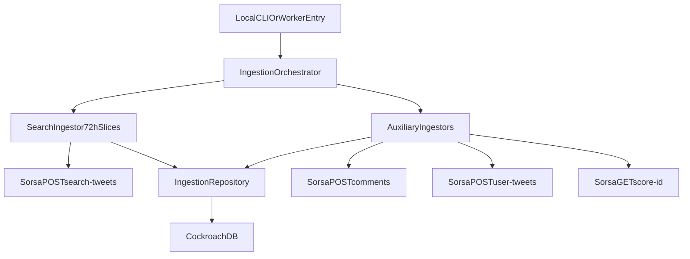

# Architecture

## High-level flow

## Component responsibilities

### `app/config.py`

- Loads all runtime settings via environment variables.
- Parses multiple API keys from a comma-separated input.

### `app/clients/sorsa_client.py`

- Implements endpoint wrappers:
  - `search_tweets`
  - `comments`
  - `user_tweets`
  - `score_id`
- Enforces per-key rate control.
- Retries transient failures (`429`, `5xx`, network timeout).

### `app/db/repository.py`

- Persists ingestion run lifecycle.
- Persists raw API payloads.
- Performs strict upsert into `mindshare_post`.
- Maintains endpoint/window checkpoints.

### `app/pipeline/search_ingestor.py`

- Splits the last 72 hours into slices.
- Executes search ingestion concurrently by slice.
- Tracks cursor progress in checkpoints.

### `app/pipeline/aux_ingestors.py`

- Ingests comments for discovered posts.
- Ingests user timelines for discovered users.
- Fetches and upserts user scores.

### `app/pipeline/orchestrator.py`

- Creates run record.
- Runs search phase, then aux phases.
- Marks run completed/failed.

## Worker portability model

The local runner and future worker both call the same orchestrator API:

- local: `python main.py --project-keyword ...`
- worker: invoke `IngestionOrchestrator.run_project_ingestion(...)` directly

No ingestion logic is tied to local-only assumptions.

