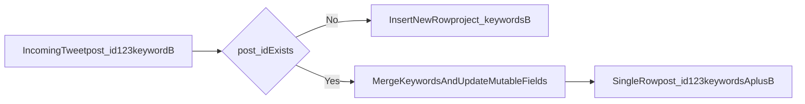

# Data Model

This page documents ingestion-specific schema behavior in `ddl/ddl_mindshare_ingestion.sql`.

## Design principles

- Strict upsert-only writes.
- One logical tweet row per `post_id`.
- No duplicate tweet rows across projects.
- `project_keywords` is merged as set-like array on conflict.

## Core tables

### `mindshare.mindshare_post`

Purpose:

- normalized tweet storage with one-row-per-`post_id`.

Important fields:

- `post_id` (PK)
- `user_x_id`
- `project_keywords` (`TEXT[]`)
- engagement counts
- relationship ids (`retweeted_post_id`, `replied_post_id`, etc.)
- `post_created_at`
- ingestion metadata (`last_ingested_run_id`, `last_seen_at`)

### `raw_data.raw_post_ingestion`

Purpose:

- raw endpoint payload storage for replay/debugging.

Uniqueness:

- primary key `(post_id, endpoint)`

### `mindshare.ingestion_run`

Purpose:

- one row per ingestion trigger with status and timing.

### `mindshare.ingestion_window_checkpoint`

Purpose:

- checkpoint cursor/state for endpoint windows and slices.

## Upsert conflict behavior

For `mindshare_post` on `post_id` conflict:

- merge `project_keywords` with existing keywords
- update engagement counts from latest payload
- keep non-empty `full_text`
- refresh `last_seen_at` and `last_ingested_run_id`

## Merge semantics diagram

