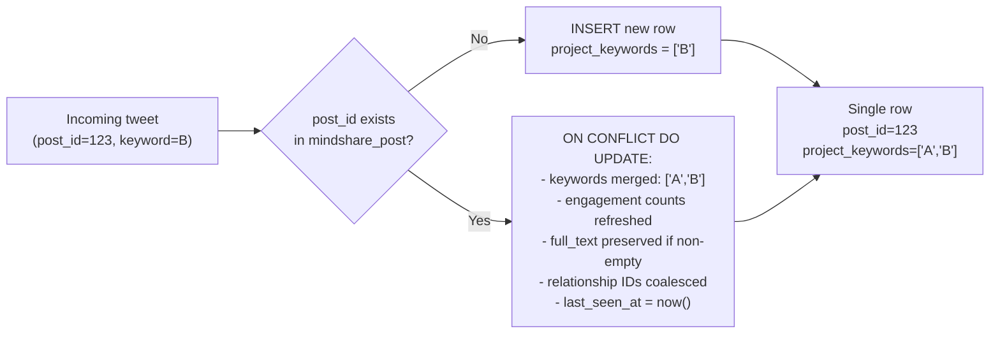

# Data Model

This page documents the full CockroachDB schema used by the ingestion pipeline. All DDL lives in `ddl/ddl_mindshare_ingestion.sql`.

---

## Schema

One schema is used:

| Schema | Purpose |
|---|---|
| `mindshare` | Normalized production data — posts, users, run tracking |

```sql
CREATE SCHEMA IF NOT EXISTS mindshare;
```

---

## Tables

### `mindshare.mindshare_user`

Stores one row per X/Twitter user, updated with their latest profile and influence score.

```sql
CREATE TABLE IF NOT EXISTS mindshare.mindshare_user (
    x_id                  INT8          NOT NULL PRIMARY KEY,
    x_username            STRING(255)   NOT NULL,
    display_name          STRING(255)   NOT NULL,
    score                 DECIMAL(10,2) NOT NULL,
    avatar_url            STRING(1000)  NOT NULL,
    adjustment_config     JSONB         NOT NULL,
    followers_count       INT4          NOT NULL,
    verified              BOOL          NOT NULL DEFAULT false,
    created_at            TIMESTAMPTZ   NOT NULL DEFAULT current_timestamp(),
    updated_at            TIMESTAMPTZ   NULL     DEFAULT current_timestamp(),
    last_score_fetched_at TIMESTAMPTZ   NULL     DEFAULT current_timestamp()
);

CREATE INDEX IF NOT EXISTS idx_mindshare_user_x_username
    ON mindshare.mindshare_user (x_username);
```

**Column notes:**

| Column | Notes |
|---|---|
| `x_id` | The numeric X/Twitter user ID (INT8). Primary key. |
| `x_username` | Twitter handle without `@`. |
| `score` | Influence score from `GET /score?user_id=<x_id>`. Stored as `DECIMAL(10,2)`. |
| `adjustment_config` | Initialized to `{"default": 1}` on insert. Not written by the ingestion pipeline beyond that default. |
| `verified` | Inserted as `false`; not populated from API data in current implementation. |
| `last_score_fetched_at` | Updated every time `upsert_user_score` runs for this user. |
| `updated_at` | Updated on every upsert conflict. |

**Populated by:** `IngestionRepository.upsert_user_score()`, called from `AuxiliaryIngestors.ingest_scores()`.

---

### `mindshare.mindshare_post`

The core normalized post table. One row per tweet, shared across all projects.

```sql
CREATE TABLE IF NOT EXISTS mindshare.mindshare_post (
    -- Core IDs
    post_id               INT8        NOT NULL PRIMARY KEY,
    user_x_id             INT8        NOT NULL,

    -- Source flags (not populated by ingestion pipeline)
    source_m              BOOL        NOT NULL DEFAULT false,
    source_n              BOOL        NOT NULL DEFAULT false,
    source_u              BOOL        NOT NULL DEFAULT false,

    -- Cross-project keyword set
    project_keywords      TEXT[]      NULL,

    -- Content
    full_text             TEXT        NOT NULL,

    -- Thread relationships
    retweeted_post_id     INT8        NULL,
    replied_post_id       INT8        NULL,
    quoted_post_id        INT8        NULL,
    root_post_id          INT8        NULL,

    -- Computed type flags (generated columns, stored)
    is_retweet  BOOL GENERATED ALWAYS AS (retweeted_post_id IS NOT NULL) STORED NOT NULL,
    is_reply    BOOL GENERATED ALWAYS AS (replied_post_id   IS NOT NULL) STORED NOT NULL,
    is_quote    BOOL GENERATED ALWAYS AS (quoted_post_id    IS NOT NULL) STORED NOT NULL,
    is_post     BOOL GENERATED ALWAYS AS (
                    retweeted_post_id IS NULL
                    AND replied_post_id IS NULL
                    AND quoted_post_id  IS NULL
                ) STORED NOT NULL,

    -- Engagement metrics
    view_count            INT4        NOT NULL DEFAULT 0,
    reply_count           INT4        NOT NULL DEFAULT 0,
    retweet_count         INT4        NOT NULL DEFAULT 0,
    quote_count           INT4        NOT NULL DEFAULT 0,
    favorite_count        INT4        NOT NULL DEFAULT 0,

    -- Raw entities (hashtags, mentions, URLs, etc.)
    entities              JSONB       NULL,

    -- Timestamps
    post_created_at       TIMESTAMPTZ NOT NULL,
    created_at            TIMESTAMPTZ NOT NULL DEFAULT current_timestamp(),
    updated_at            TIMESTAMPTZ NULL     DEFAULT current_timestamp(),

    -- Ingestion tracking
    last_ingested_run_id  UUID        NULL,
    last_seen_at          TIMESTAMPTZ NULL     DEFAULT current_timestamp()
);
```

**Indexes:**

```sql
CREATE INDEX IF NOT EXISTS idx_mindshare_post_created_at
    ON mindshare.mindshare_post (post_created_at DESC);

CREATE INDEX IF NOT EXISTS idx_mindshare_post_user_x_id
    ON mindshare.mindshare_post (user_x_id);

CREATE INVERTED INDEX IF NOT EXISTS idx_mindshare_post_project_keywords
    ON mindshare.mindshare_post (project_keywords);
```

The inverted index on `project_keywords` enables efficient array containment queries such as `WHERE 'Acurast' = ANY(project_keywords)`.

**Generated columns:**

`is_retweet`, `is_reply`, `is_quote`, `is_post` are `GENERATED ALWAYS AS ... STORED` columns — CockroachDB computes and stores them automatically. They can be used in filters and indexes without extra application logic.

**Column-to-API-field mapping** (how `upsert_mindshare_post` populates this table):

| DB column | Extracted from raw payload |
|---|---|
| `post_id` | `payload["id"]` cast to INT8 |
| `user_x_id` | `payload["user"]["id"]` cast to INT8 |
| `project_keywords` | `ARRAY[project_keyword]` — merged on conflict |
| `full_text` | `payload["full_text"]` |
| `retweeted_post_id` | `payload["retweeted_status"]["id"]` (NULLIF empty string) |
| `replied_post_id` | `payload["in_reply_to_tweet_id"]` (NULLIF empty string) |
| `quoted_post_id` | `payload["quoted_status"]["id"]` (NULLIF empty string) |
| `root_post_id` | `payload["conversation_id_str"]` (NULLIF empty string) |
| `view_count` | `payload["view_count"]` |
| `reply_count` | `payload["reply_count"]` |
| `retweet_count` | `payload["retweet_count"]` |
| `quote_count` | `payload["quote_count"]` |
| `favorite_count` | `payload["likes_count"]` |
| `entities` | `payload["entities"]` as JSONB |
| `post_created_at` | `payload["created_at"]` cast to TIMESTAMPTZ |
| `last_ingested_run_id` | `run_id` (the current run UUID) |

**Populated by:** `IngestionRepository.upsert_mindshare_posts_batch()`, called for tweets from all three phases: search, comments, and user-tweets.

---

### `mindshare.ingestion_run`

One row per pipeline execution. Tracks run lifecycle.

```sql
CREATE TABLE IF NOT EXISTS mindshare.ingestion_run (
    run_id          UUID        PRIMARY KEY,
    project_keyword TEXT        NOT NULL,
    since_ts        TIMESTAMPTZ NOT NULL,
    until_ts        TIMESTAMPTZ NOT NULL,
    run_status      TEXT        NOT NULL,
    error_summary   TEXT        NULL,
    started_at      TIMESTAMPTZ NOT NULL DEFAULT current_timestamp(),
    finished_at     TIMESTAMPTZ NULL
);

CREATE INDEX IF NOT EXISTS idx_ingestion_run_status
    ON mindshare.ingestion_run (run_status, started_at DESC);
```

**Lifecycle states for `run_status`:**

| Value | Set when |
|---|---|
| `'running'` | On `create_run()` — immediately at pipeline start |
| `'completed'` | On `mark_run_finished(status='completed')` — after all phases succeed |
| `'failed'` | On `mark_run_finished(status='failed', error=...)` — if any phase raises an uncaught exception |

**Populated by:** `IngestionRepository.create_run()` and `IngestionRepository.mark_run_finished()`.

---

## Upsert conflict behavior summary



### `mindshare_post` conflict rules (full detail)

| Column | On conflict behavior |
|---|---|
| `project_keywords` | `array_agg(DISTINCT k)` over `existing \|\| incoming` — deduplicates, set-union semantics |
| `full_text` | Replace only if incoming is non-empty; keep existing if incoming is empty string |
| `user_x_id` | Always overwritten with incoming value |
| `retweeted_post_id` | `COALESCE(incoming, existing)` — keeps first non-null |
| `replied_post_id` | `COALESCE(incoming, existing)` |
| `quoted_post_id` | `COALESCE(incoming, existing)` |
| `root_post_id` | `COALESCE(incoming, existing)` |
| `view_count` | Always overwritten |
| `reply_count` | Always overwritten |
| `retweet_count` | Always overwritten |
| `quote_count` | Always overwritten |
| `favorite_count` | Always overwritten |
| `entities` | `COALESCE(incoming, existing)` |
| `last_ingested_run_id` | Always overwritten |
| `last_seen_at` | Always set to `now()` |

### `mindshare_user` conflict rules

| Column | On conflict behavior |
|---|---|
| `x_username` | `COALESCE(NULLIF(incoming, ''), existing)` — keeps existing if incoming is empty |
| `display_name` | Same pattern |
| `score` | `COALESCE(incoming, existing)` |
| `avatar_url` | `COALESCE(NULLIF(incoming, ''), existing)` |
| `followers_count` | `COALESCE(incoming, existing)` |
| `last_score_fetched_at` | Always set to `now()` |
| `updated_at` | Always set to `now()` |
