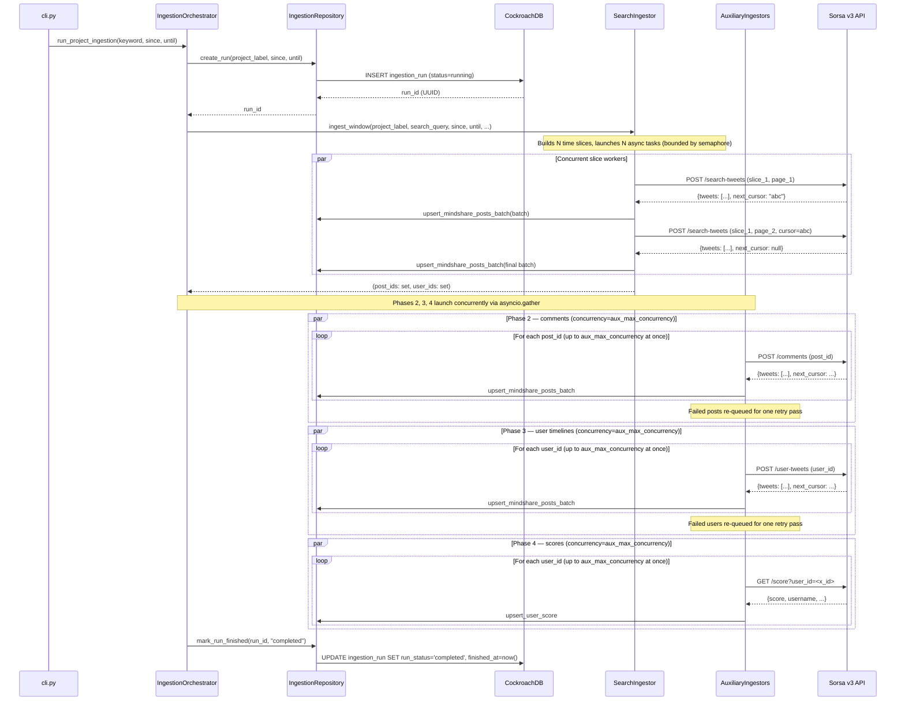
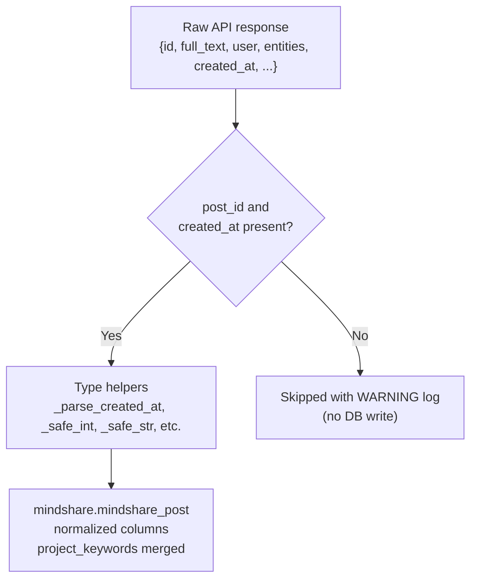

# Pipeline Behavior

This page documents the exact execution flow of the ingestion pipeline, phase by phase, from entry point to database commit.

---

## Full execution sequence



---

## Time window resolution

The search window is resolved in the orchestrator before any API calls:

```python
effective_until = until or datetime.now(timezone.utc)
effective_since = since or (effective_until - timedelta(hours=hours))
```

`--since` / `--until` always take priority over `--hours`. When `--since` is given without `--until`, the window ends at the current time.

---

## Keyword to search query transformation

The `--project-keyword` CLI argument is a comma-separated string. The orchestrator transforms it before use:

```python
terms = [t.strip() for t in project_keyword.split(",") if t.strip()]
project_label = terms[0]   # used as the DB identifier
search_query = " OR ".join(f'"{t}"' if " " in t else t for t in terms)
```

Examples:

| CLI input | `project_label` | `search_query` sent to API |
|---|---|---|
| `"quipnetwork"` | `quipnetwork` | `quipnetwork` |
| `"quipnetwork,Quip Network,quip_network"` | `quipnetwork` | `quipnetwork OR "Quip Network" OR quip_network` |

`project_label` is stored in `ingestion_run.project_keyword` and in `mindshare_post.project_keywords` for all phases. It never contains the full raw CLI string.

---

## Phase 1 — Search (`/search-tweets`)

### Time slicing

`build_time_slices(since, until, slice_count, keys)` divides the window into `SEARCH_SLICE_COUNT` equal-width sub-windows:

```python
step = (until - since).total_seconds() / slice_count
for i in range(slice_count):
    start = since + timedelta(seconds=i * step)
    end   = since + timedelta(seconds=(i + 1) * step)  # last always ends at until
    key_alias = keys[i % len(keys)].alias
```

With `SEARCH_SLICE_COUNT=20` over 72 hours and 2 keys: 20 slices of 3.6 hours each, alternating between `key_1` and `key_2`.

### Concurrency

```python
effective_concurrency = max(1, min(slice_count, max_concurrency))
sem = asyncio.Semaphore(effective_concurrency)
```

`max_concurrency` is `len(keys) × SORSA_PER_KEY_RPS` (auto-computed unless overridden). `per_key_rps` is **not** included in the `min()` — it is already folded into `max_concurrency`, so including it would incorrectly cap multi-key capacity.

With 20 slices and `max_concurrency=40`: `effective_concurrency = min(20, 40) = 20` — all 20 slices start simultaneously, each acquiring the semaphore immediately.

### Per-slice pagination and write buffer

Each slice runs independently:

```
buffer = []
cursor = None

while True:
    data = POST /search-tweets (search_query with since:/until: inline, cursor, order)
    tweets = [t for t in data["tweets"] if isinstance(t, dict)]

    buffer.extend(tweets)
    cursor = data.get("next_cursor")

    # Flush full batches immediately
    while len(buffer) >= batch_size:
        upsert_mindshare_posts_batch(buffer[:batch_size], project_label)
        buffer = buffer[batch_size:]

    if not cursor:
        break

# Drain remaining records
if buffer:
    upsert_mindshare_posts_batch(buffer, project_label)
```

The buffer is **per slice** — concurrent slices each maintain their own. Batch writes use `conn.executemany` within a single transaction.

**Batching examples** (20 tweets/page, batch_size=1000):

| Records in slice | Pages | Batches from loop | Final drain | Total batches |
|---|---|---|---|---|
| 800 | 40 | 0 | 800 | 1 |
| 1000 | 50 | 1 × 1000 | — | 1 |
| 1500 | 75 | 1 × 1000 | 500 | 2 |
| 11000 | 550 | 11 × 1000 | — | 11 |

On any exception from a slice: the exception propagates through `asyncio.gather`, aborting the entire search phase and marking the run `failed`.

### Output

`ingest_window` returns `(all_post_ids: set[str], all_user_ids: set[str])` — union of all IDs across all slices, deduplicated. These drive Phases 2–4.

### Slice width and data completeness

The Sorsa/Twitter search API returns relevance-ranked results, not an exhaustive index. **Wider slices surface more tweets per query.** A 3.6-hour window may return hundreds of pages of results for an active query, while splitting it into two 1.8-hour halves can result in one half returning zero results (the API's ranking algorithm finds no results for that narrower context window). The default `SEARCH_SLICE_COUNT=20` (3.6h per slice over 72h) is chosen empirically for good coverage.

---

## Phase 2 — Comments (`/comments`)

`ingest_comments_for_posts(run_id, project_label, post_ids, keys, max_concurrency)`:

Creates one async task per `post_id`. Up to `aux_max_concurrency` tasks run simultaneously:

```
sem = asyncio.Semaphore(max_concurrency)

async def _fetch_post(idx, post_id):
    key = keys[idx % len(keys)]
    async with sem:
        cursor = None
        while True:
            data = POST /comments (tweet_link=post_id, cursor=cursor)
            tweets = [t for t in data["tweets"] if isinstance(t, dict)]
            upsert_mindshare_posts_batch(tweets, project_label)
            cursor = data.get("next_cursor")
            if not cursor: break
        return (count, True)   # success
    # on exception: return (count_so_far, False)

results = await asyncio.gather(*[_fetch_post(i, pid) for i, pid in enumerate(post_list)])
```

After the main pass, failed posts are re-queued for **one retry pass**. Posts still failing after the retry are logged as `ERROR` with their IDs and counted as `permanently failed`.

Final log line: `[comments] Phase complete — N comment(s) ingested | M post(s) ok, K permanently failed`

---

## Phase 3 — User timelines (`/user-tweets`)

`ingest_user_tweets(run_id, project_label, user_ids, keys, max_concurrency)`:

Identical structure to Phase 2, but paginates `POST /user-tweets` per user:

```
async def _fetch_user(idx, user_id):
    key = keys[idx % len(keys)]
    async with sem:
        cursor = None
        while True:
            data = POST /user-tweets (user_id=user_id, cursor=cursor)
            tweets = [t for t in data["tweets"] if isinstance(t, dict)]
            upsert_mindshare_posts_batch(tweets, project_label)
            cursor = data.get("next_cursor")
            if not cursor: break
        return (count, True)
```

Same retry pass: failed users after the main gather are re-queued once. Retry starts from page 1 (fresh cursor) — tweets already written are upserted again (idempotent).

Final log line: `[user-tweets] Phase complete — N tweet(s) ingested | M user(s) ok, K permanently failed`

**Note on data volume:** user timeline fetches can be very deep. A user with 800+ tweets will require 40+ pages. With thousands of users, Phase 3 typically dominates total run time. The OR-keyword query exacerbates this — broader search → more unique users found → more timelines to fetch.

---

## Phase 4 — User scores (`GET /score`)

`ingest_scores(run_id, project_label, user_ids, keys, max_concurrency)`:

One request per user, not paginated:

```
async def _score_user(idx, user_id):
    key = keys[idx % len(keys)]
    async with sem:
        data = GET /score?user_id=<user_id>
        upsert_user_score(x_id, username, display_name, avatar_url, followers_count, score)
        return True   # success / False on exception
```

Per-user failures are logged as `WARNING` and do not trigger a retry (score fetches are cheap to re-run on the next full pipeline run). Final log: `[scores] Phase complete — N scored, K failed out of M user(s)`.

---

## Retry and rate-limit strategy

All HTTP calls flow through `SorsaClient._request()`.

### Rate limiting

The `PerKeyRateLimiter` enforces **`SORSA_PER_KEY_RPS` requests per second per key** (default: 20):

- Maintains a `deque[float]` of request timestamps per alias.
- Every `acquire(alias)` call checks: if fewer than `rps` requests in the last 1 second → allow and increment counter. Otherwise sleep until capacity is available.
- `acquire()` is called before **every retry attempt** — the per-second cap applies uniformly regardless of attempt count.
- With 2 keys at 20 RPS each: total throughput = 40 req/s, shared across all concurrent phases.

### HTTP retry table

| Error type | Retry condition | Sleep |
|---|---|---|
| HTTP 429 | `attempt < max_retries` | `retry_429_sleep_seconds` (default: 1.0s) |
| HTTP 5xx | `attempt < max_retries` | `retry_5xx_sleep_seconds` (default: 2.0s) |
| `aiohttp.ClientError` / `asyncio.TimeoutError` | `attempt < max_retries` | `retry_5xx_sleep_seconds` |
| Empty/non-JSON body (`json.JSONDecodeError`, `ContentTypeError`) | `attempt < max_retries` | `retry_5xx_sleep_seconds` |
| HTTP 429 on final attempt | — | Raises `SorsaRateLimitError` |
| Any other error after retries | — | Raises `SorsaClientError` |

### Aux-phase retry table (user/post level)

| Situation | Behavior |
|---|---|
| Page fetch fails (any exception) | Logged as `WARNING`; `_fetch_user` / `_fetch_post` returns `(count_so_far, False)` |
| After main `asyncio.gather` | Failed IDs collected; one retry pass launched |
| Retry pass fails again | Logged as `ERROR` with IDs; counted as `permanently failed` |
| Score fetch fails | Logged as `WARNING`; no retry (next full run will re-fetch) |

### Error propagation summary

| Error source | Behavior |
|---|---|
| Search slice (any page) | Re-raised → propagates through `asyncio.gather` → aborts Phase 1 → marks run `failed` |
| Comments per post (after retry) | Counted as permanently failed; run continues |
| User timeline per user (after retry) | Counted as permanently failed; run continues |
| Score per user | Swallowed → next user starts; run continues |

---

## Logging

All log output uses Python's `logging` module. The CLI sets up `INFO` level with:
- **Console handler** — visible in the terminal.
- **File handler** — written to `logs/YYYY-MM-DD/run_HHMMSS_<uuid8>.log`.

Format: `YYYY-MM-DD HH:MM:SS [LEVEL] logger.name: message`

### `app.cli` — startup and completion

| Level | Event | Example |
|---|---|---|
| INFO | Log file created | `Log file: logs/2026-05-09/run_103915_9b402f04.log` |
| INFO | Run completes | `Ingestion completed — run_id=... \| elapsed=19.7 min (19m 42s)` |

### `app.pipeline.orchestrator` — run lifecycle

| Level | Event | Example |
|---|---|---|
| INFO | Run starts | `Starting ingestion — label='quipnetwork' search_query='quipnetwork OR "Quip Network"' window=2026-05-06 08:01 UTC → 2026-05-09 08:01 UTC` |
| INFO | Run record created | `Run created — run_id=3fa85f64-...` |
| INFO | Phase 1 starts | `Phase 1 — search (/search-tweets) starting` |
| INFO | Phase 1 complete | `Phase 1 complete — posts_found=969 users_found=384` |
| INFO | Request counts | `After phase 1: Request counts — total=71 \| key_1=26, key_2=45` |
| INFO | Aux phases start | `Phases 2+3+4 — starting concurrently (posts=969 users=384 concurrency=100)` |
| INFO | Request counts | `After phases 2+3+4: Request counts — total=15357 \| key_1=7708, key_2=7649` |
| INFO | Final totals | `Final totals: Request counts — total=15357 \| key_1=7708, key_2=7649` |
| INFO | Run completes | `Ingestion completed — run_id=...` |
| ERROR | Run fails | `Ingestion failed — run_id=... error=<exception string>` |
| INFO | Counts at failure | `Counts at failure: Request counts — total=N \| key_1=N, key_2=N` |

### `app.pipeline.search_ingestor` — search phase

| Level | Event | Example |
|---|---|---|
| INFO | Phase starts | `Search ingestion starting — label='quipnetwork' query='quipnetwork OR "Quip Network"' slices=20 effective_concurrency=20 batch_size=1000 window=...` |
| INFO | Slice starts | `[slice 5] Starting — key=key_1 window=2026-05-06 22:25 UTC → 2026-05-07 02:01 UTC` |
| INFO | Page fetched | `[slice 5] Page 1 — 20 tweets (20 posts, 20 users) \| buffer=20/1000 \| has_next=True` |
| INFO | Batch written | `[slice 5] Batch 1 written — 1000 records (slice total: 1000)` |
| INFO | Slice done | `[slice 5] Done — 19312 posts, 3315 users \| 967 page(s) \| 20 batch(es) \| total written=19312` |
| ERROR | Slice failed | `[slice 12] Failed on page 551 — buffer=1000 unflushed, already written=10000: <error>` |
| INFO | All slices done | `Search ingestion complete — total_posts=58677 total_users=5582 across 20 slices` |

### `app.pipeline.aux_ingestors` — aux phases

**Comments:**

| Level | Event | Example |
|---|---|---|
| INFO | Phase starts | `[comments] Starting — 969 post(s) \| keys=2 \| concurrency=100` |
| INFO | Post task starts | `[comments] (1/969) post_id=2052175009779708147 key=key_1` |
| INFO | Post done | `[comments] post_id=... done — 3 comment(s) across 1 page(s)` |
| WARNING | Post failed | `[comments] post_id=... failed on page 2 after 20 comment(s): <error>` |
| WARNING | Retry pass | `[comments] 3 post(s) failed — retrying once: [pid1, pid2, ...]` |
| ERROR | Still failing | `[comments] 1 post(s) still failed after retry: [pid1]` |
| INFO | Phase done | `[comments] Phase complete — 325 comment(s) ingested \| 968 post(s) ok, 1 permanently failed` |

**User timelines:**

| Level | Event | Example |
|---|---|---|
| INFO | Phase starts | `[user-tweets] Starting — 384 user(s) \| keys=2 \| concurrency=100` |
| INFO | User task starts | `[user-tweets] (1/384) user_id=1234567890 key=key_1` |
| INFO | User done | `[user-tweets] user_id=... done — 850 tweet(s) across 44 page(s)` |
| WARNING | User failed | `[user-tweets] user_id=... failed on page 16 after 298 tweet(s): <error>` |
| WARNING | Retry pass | `[user-tweets] 40 user(s) failed — retrying once: [uid1, uid2, ...]` |
| ERROR | Still failing | `[user-tweets] 3 user(s) still failed after retry: [uid1, uid2, uid3]` |
| INFO | Phase done | `[user-tweets] Phase complete — 256172 tweet(s) ingested \| 381 user(s) ok, 3 permanently failed` |

**Scores:**

| Level | Event | Example |
|---|---|---|
| INFO | Phase starts | `[scores] Starting — 384 user(s) \| keys=2 \| concurrency=100` |
| INFO | Score fetched | `[scores] (1/384) user_id=... username=alice score=8.45` |
| WARNING | Score failed | `[scores] (2/384) user_id=... failed: <error>` |
| INFO | Phase done | `[scores] Phase complete — 383 scored, 1 failed out of 384 user(s)` |

### `app.clients.sorsa_client`

| Level | Event | Example |
|---|---|---|
| WARNING | 429 retry | `[key_1] POST /search-tweets → 429; sleeping 1.0s before retry 2/5` |
| WARNING | 5xx retry | `[key_1] POST /user-tweets → 503; sleeping 2.0s before retry 2/5` |
| WARNING | Empty body retry | `[key_2] POST /user-tweets — empty/non-JSON body on attempt 1/5; sleeping 2.0s before retry` |
| ERROR | Empty body final | `[key_2] POST /user-tweets — empty/non-JSON body on final attempt 5/5` |
| ERROR | Non-retryable | `[key_1] GET /score → 400 non-retryable error: {...}` |
| INFO | Request counts | `After phase 1: Request counts — total=71 \| key_1=26, key_2=45` |

### `app.db.repository`

| Level | Event | Example |
|---|---|---|
| WARNING | Row skipped | `DB: upsert_mindshare_posts_batch — skipping row missing field(s): id, created_at (raw_id='' raw_user_id='...' raw_created_at='')` |
| WARNING | DB retry | `DB: upsert_mindshare_posts_batch — connection error (attempt 1/3), retrying in 1.0s: <error>` |
| ERROR | DB final failure | `DB: upsert_mindshare_posts_batch — connection error on final attempt 3/3: <error>` |

---

## Data flow per tweet

Every tweet API response passes through this pipeline:



---

## Run outcome states

| Scenario | `ingestion_run.run_status` | Notes |
|---|---|---|
| All phases complete | `completed` | Normal exit |
| Any slice in Phase 1 fails | `failed` | `error_summary` contains exception string |
| Phase 1 succeeds; some comments/timelines/scores fail | `completed` | Per-item failures in aux phases are retried once, then counted as permanently failed; run still completes |
| Unexpected exception escapes orchestrator | `failed` | Covers programming errors, DB connection loss, etc. |
