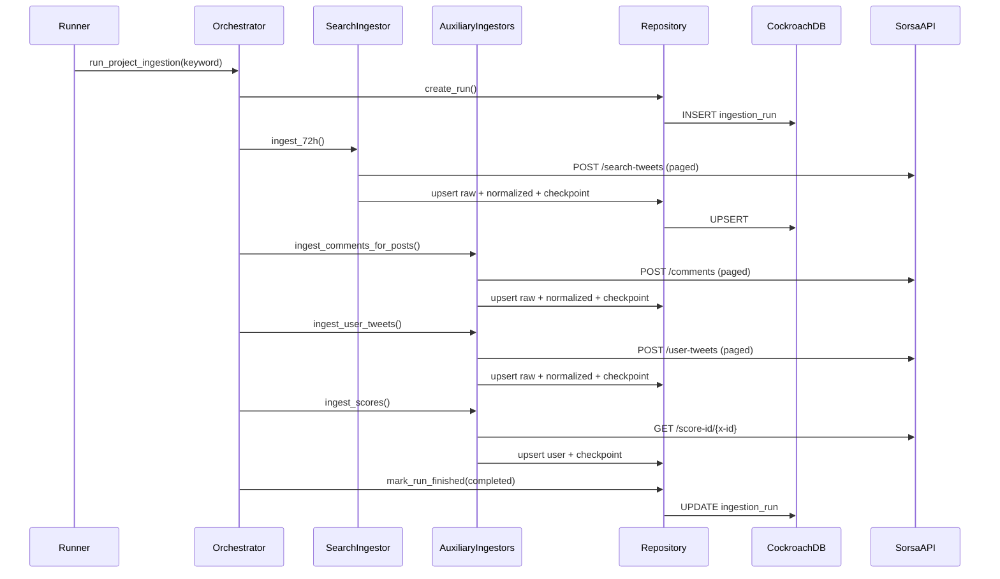

# Pipeline Behavior

## 1) Search phase (`/search-tweets`)

- Compute `until = now_utc` and `since = now_utc - 72h`.
- Split time range into configured slices.
- Assign slices to API-key aliases.
- Run slices concurrently with config-driven cap:
  - `min(SEARCH_SLICE_COUNT, SEARCH_MAX_CONCURRENCY, SORSA_PER_KEY_RPS)`
- For each slice:
  - fetch pages using `next_cursor`
  - persist raw rows
  - upsert normalized rows
  - update checkpoint status (`running` -> `completed`)

## 2) Comments phase (`/comments`)

- Iterate discovered post IDs from search phase.
- Fetch and ingest paginated comments.
- Write endpoint checkpoint per post window.

## 3) User timeline phase (`/user-tweets`)

- Iterate discovered user IDs from search phase.
- Fetch and ingest paginated user timeline tweets.
- Write endpoint checkpoint per user window.

## 4) Score phase (`/score-id/{x-id}`)

- Iterate discovered user IDs.
- Fetch score payload and upsert `mindshare_user`.
- Write endpoint checkpoint per user.

## Retry and rate-limit strategy

Applied in `SorsaClient`:

- per-key RPS limiter
- retries for:
  - `429`
  - `5xx`
  - network/timeout
- fail-fast for non-retryable client errors after response handling

## Sequence

