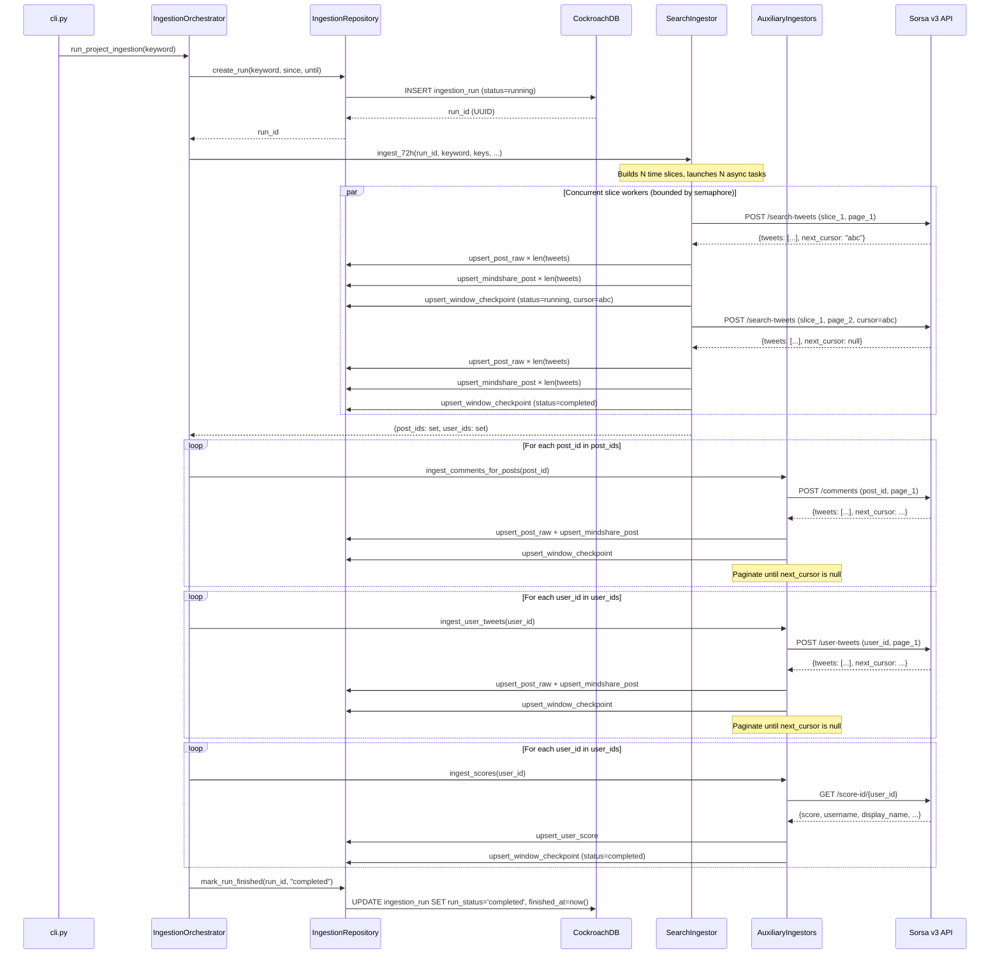
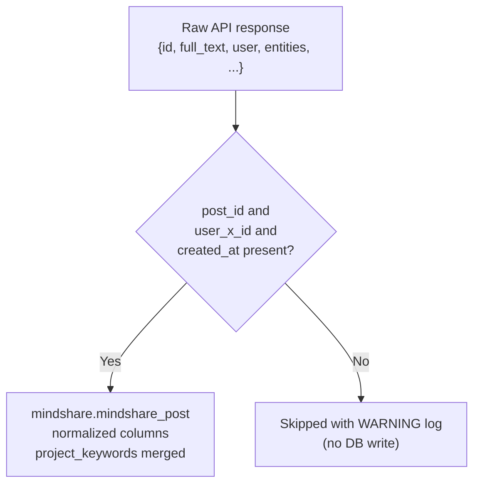

# Pipeline Behavior

This page documents the exact execution flow of the ingestion pipeline, phase by phase, from entry point to database commit.

---

## Full execution sequence



---

## Phase 1 — Search (`/search-tweets`)

### Time window setup

Every run computes a fresh 72-hour window anchored to the moment of execution:

```python
until = datetime.now(timezone.utc)
since = until - timedelta(hours=72)
```

Both `SearchIngestor.ingest_72h` and `IngestionOrchestrator.run_project_ingestion` compute this window independently — they are consistent because both use `now()` at call time and 72h is the fixed offset.

### Time slicing

`build_time_slices(since, until, slice_count, keys)` divides the 72-hour window into `SEARCH_SLICE_COUNT` equal-width sub-windows:

```python
step = total_seconds / slice_count
for i in range(slice_count):
    start = since + timedelta(seconds=i * step)
    end   = since + timedelta(seconds=(i + 1) * step)  # last slice always ends at `until`
    key_alias = keys[i % len(keys)].alias
```

Each `TimeSlice` carries its `slice_id` (1-based), `since`, `until`, and the assigned `api_key_alias`.

With the default `SEARCH_SLICE_COUNT=20` over 72 hours, each slice covers exactly 3.6 hours (216 minutes).

### Concurrency

```python
effective_concurrency = max(1, min(slice_count, max_concurrency, per_key_rps))
sem = asyncio.Semaphore(effective_concurrency)
```

All `slice_count` coroutines are created immediately via `asyncio.gather(*tasks)`. Each coroutine acquires the semaphore at the start of `_ingest_slice` — so at most `effective_concurrency` slices run at the same time. Completed slices release the semaphore, allowing waiting slices to start.

### Per-slice pagination loop and write buffer

`_ingest_slice` accumulates tweets in an in-memory buffer across pages. There is one trigger inside the page loop and one drain outside it:

```
cursor = None
buffer = []
batch_num = 0
total_written = 0

# ── page loop ─────────────────────────────────────────────────────────────
while True:
  data = POST /search-tweets (query, since, until, cursor, order)
  tweets = [t for t in data["tweets"] if isinstance(t, dict)]

  for tweet in tweets:
    collect post_id, user_id into local sets

  buffer.extend(tweets)
  cursor = data.get("next_cursor")

  # Write every full batch as soon as it is ready.
  # Partial tail (< batch_size) stays in memory until the next page fills it.
  while len(buffer) >= batch_size:
    batch_num += 1
    upsert_posts_raw_batch(endpoint="/search-tweets", payloads=buffer[:batch_size])
    upsert_mindshare_posts_batch(payloads=buffer[:batch_size])
    total_written += batch_size
    buffer = buffer[batch_size:]

  upsert_window_checkpoint(status="running"|"completed", next_cursor=cursor)

  if not cursor:
    break           # all pages fetched; exit loop

# ── final batch ───────────────────────────────────────────────────────────
# Write the remaining records (< batch_size) that didn't fill a full batch.
if buffer:
  batch_num += 1
  upsert_posts_raw_batch(..., payloads=buffer)
  upsert_mindshare_posts_batch(..., payloads=buffer)
  total_written += len(buffer)

return (post_ids, user_ids)
```

**What "final batch" means:** after all pages are exhausted, the buffer holds the records that accumulated since the last full-batch write. For 3500 tweets (batch_size=1000): the loop writes batches 1–3 (1000 each); after the loop, 500 remain and are written as batch 4. For 800 tweets: no full batch fires inside the loop; the final drain writes all 800 as batch 1.

**Examples** (Sorsa = 20 tweets/page, batch_size = 1000):

| Records in slice | Pages fetched | Batches from loop | Final drain | Total batches |
|---|---|---|---|---|
| 800 | 40 | 0 | 800 | 1 |
| 1000 | 50 | 1 × 1000 | — | 1 |
| 1500 | 75 | 1 × 1000 | 500 | 2 |
| 3200 | 160 | 3 × 1000 | 200 | 4 |
| 3000 | 150 | 3 × 1000 | — | 3 |

The buffer is **per slice** — each concurrent slice manages its own independent buffer. Checkpoints are always written per page, not per batch, so resumability is unaffected.

On exception at any point:
```
upsert_window_checkpoint(status="failed", error_message=str(exc))
raise  ← propagates to asyncio.gather, which fails the whole search phase
```

### Search query format

The query sent to the API is:

```
{project_keyword} since:{YYYY-MM-DD_HH:MM:SS_UTC} until:{YYYY-MM-DD_HH:MM:SS_UTC}
```

The `to_sorsa_date(dt)` helper in `sorsa_client.py` formats the datetime into this string.

### Output

`ingest_72h` returns `(all_post_ids: set[str], all_user_ids: set[str])` — the union of all IDs across all slices, deduplicated. These sets drive Phases 2–4.

---

## Phase 2 — Comments (`/comments`)

`AuxiliaryIngestors.ingest_comments_for_posts(posts, key, ...)` iterates over every `post_id` discovered in Phase 1.

For each post:

```
window_id = f"comments_{post_id}"
cursor = None
loop:
  data = POST /comments (tweet_link=post_id, next_cursor=cursor)
  tweets = [t for t in data["tweets"] if isinstance(t, dict)]

  # Batch-write the whole page in two transactions
  upsert_posts_raw_batch(endpoint="/comments", payloads=tweets)
  upsert_mindshare_posts_batch(payloads=tweets, project_keyword=keyword)

  cursor = data.get("next_cursor")
  upsert_window_checkpoint(status="running"|"completed", next_cursor=cursor)
  if not cursor: break
```

On exception:
```
upsert_window_checkpoint(status="failed", error_message=str(exc))
break  ← moves to next post (does not propagate)
```

Important: exceptions are **caught and swallowed** at the per-post level. A failure on one post's comments does not abort Phase 2 or the run. The failure is recorded in the checkpoint table.

Comments discovered here are inserted into `mindshare_post` under the same `project_keyword` as the search. This means a comment thread post can be associated with the keyword even if it wasn't returned by the search query directly.

---

## Phase 3 — User timelines (`/user-tweets`)

`AuxiliaryIngestors.ingest_user_tweets(user_ids, key, ...)` iterates over every `user_id` discovered in Phase 1.

For each user:

```
window_id = f"user_{user_id}"
cursor = None
loop:
  data = POST /user-tweets (user_id=user_id, next_cursor=cursor)
  tweets = [t for t in data["tweets"] if isinstance(t, dict)]

  # Batch-write the whole page in two transactions
  upsert_posts_raw_batch(endpoint="/user-tweets", payloads=tweets)
  upsert_mindshare_posts_batch(payloads=tweets, project_keyword=keyword)

  cursor = data.get("next_cursor")
  upsert_window_checkpoint(status="running"|"completed", next_cursor=cursor)
  if not cursor: break
```

On exception: checkpoint written as `failed`, loop breaks to next user.

User timeline tweets are also upserted into `mindshare_post` under the project keyword. This may associate unrelated tweets from a user's timeline with the project — this is intentional for mindshare tracking.

---

## Phase 4 — User scores (`/score-id/{x_id}`)

`AuxiliaryIngestors.ingest_scores(user_ids, key, ...)` iterates over every `user_id` discovered in Phase 1.

For each user:

```
window_id = f"score_{user_id}"
data = GET /score-id/{user_id}
upsert_user_score(
    x_id=user_id,
    username=data["username"],
    display_name=data["display_name"],
    avatar_url=data["profile_image_url"],
    followers_count=data["followers_count"],
    score=data["score"]
)
upsert_window_checkpoint(status="completed")
```

On exception: checkpoint written as `failed`, continues to next user. Scores are not paginated — one HTTP call per user.

---

## Retry and rate-limit strategy

All HTTP calls flow through `SorsaClient._request()`.

### Rate limiting

The `PerKeyRateLimiter` enforces a flat limit of **`SORSA_PER_KEY_RPS` requests per second** per API key alias (default: 20 req/s):

- Maintains a `deque[float]` of request timestamps per alias.
- Every call to `acquire(alias)` checks: if fewer than `rps` requests were made in the last 1 second, record the timestamp, **increment the counter for that alias**, and allow the request. Otherwise, sleep until the oldest tracked request is more than 1 second old, then retry.
- The lock is released before sleeping so other coroutines are not blocked.
- `acquire()` is called before **every retry attempt**, not just the first — the per-second cap and the counter apply uniformly regardless of attempt count.

### Retry logic

| Error type | Retry condition | Sleep before retry |
|---|---|---|
| HTTP 429 | If `attempt < max_retries` | `retry_429_sleep_seconds` (default: 1.0s) |
| HTTP 5xx | If `attempt < max_retries` | `retry_5xx_sleep_seconds` (default: 2.0s) |
| `aiohttp.ClientError` / `asyncio.TimeoutError` | If `attempt < max_retries` | `retry_5xx_sleep_seconds` |
| HTTP 429 on final attempt | — | Raises `SorsaRateLimitError` |
| Any other error after retries | — | Raises `SorsaClientError` |

The client timeout is set to 60 seconds (`aiohttp.ClientTimeout(total=60)`) in the orchestrator.

### Error propagation summary

| Error source | Behavior |
|---|---|
| Search slice (any page) | Re-raised → propagates through `asyncio.gather` → aborts search phase → marks run `failed` |
| Comments per post | Swallowed → next post starts; run continues |
| User timeline per user | Swallowed → next user starts; run continues |
| Score per user | Swallowed → next user starts; run continues |

---

## Logging

All log output uses Python's `logging` module. The CLI configures `logging.basicConfig` at `INFO` level with the format:

```
YYYY-MM-DD HH:MM:SS [LEVEL] logger.name: message
```

`DEBUG` log lines (per-request dispatch, per-page pagination, per-DB-operation details) are emitted but suppressed at the default `INFO` level. Pass `--log-level DEBUG` or call `logging.basicConfig(level=logging.DEBUG, ...)` to see them.

---

### `app.pipeline.orchestrator` — run lifecycle

| Level | Event | Example |
|---|---|---|
| INFO | Run starts | `Starting ingestion — keyword='Acurast' window=2026-05-04 18:00 UTC → 2026-05-07 18:00 UTC` |
| INFO | Run record created | `Run created — run_id=3fa85f64-5717-4562-b3fc-2c963f66afa6` |
| INFO | Phase 1 starts | `Phase 1 — search (/search-tweets) starting` |
| INFO | Phase 1 complete | `Phase 1 complete — posts_found=842 users_found=310` |
| INFO | Request counts snapshot | `After phase 1: Request counts — total=243 \| key_1=243` |
| INFO | Phase 2 starts | `Phase 2 — comments (/comments) starting — posts=842` |
| INFO | Request counts snapshot | `After phase 2: Request counts — total=1105 \| key_1=1105` |
| INFO | Phase 3 starts | `Phase 3 — user timelines (/user-tweets) starting — users=310` |
| INFO | Request counts snapshot | `After phase 3: Request counts — total=1729 \| key_1=1729` |
| INFO | Phase 4 starts | `Phase 4 — user scores (/score-id) starting — users=310` |
| INFO | Request counts snapshot | `After phase 4: Request counts — total=2039 \| key_1=2039` |
| INFO | Final totals | `Final totals: Request counts — total=2039 \| key_1=2039` |
| INFO | Run completes | `Ingestion completed — run_id=3fa85f64-...` |
| ERROR | Run fails | `Ingestion failed — run_id=3fa85f64-... error=<exception string>` |
| INFO | Counts at failure | `Counts at failure: Request counts — total=N \| key_1=N` |

---

### `app.pipeline.search_ingestor` — search phase

| Level | Event | Example |
|---|---|---|
| INFO | Phase starts | `Search ingestion starting — keyword='Acurast' slices=20 effective_concurrency=20 batch_size=1000 window=...` |
| INFO | Slice starts | `[slice 3] Starting — key=key_1 window=2026-05-04 06:00 UTC → 09:36 UTC` |
| INFO | Page fetched | `[slice 3] Page 1 — 20 tweets (20 posts, 17 users) \| buffer=20/1000 \| has_next=True` |
| INFO | Page fetched | `[slice 3] Page 50 — 20 tweets (20 posts, 18 users) \| buffer=1000/1000 \| has_next=True` |
| INFO | Full batch written | `[slice 3] Batch 1 written — 1000 records (slice total: 1000)` |
| INFO | Page fetched | `[slice 3] Page 75 — 20 tweets (19 posts, 15 users) \| buffer=500/1000 \| has_next=False` |
| INFO | Final batch written | `[slice 3] Batch 2 written — 500 records (slice total: 1500)` |
| INFO | Slice done | `[slice 3] Done — 1420 posts, 870 users \| 75 page(s) \| 2 batch(es) \| total written=1500` |
| ERROR | Slice failed | `[slice 3] Failed on page 51 — buffer=20 unflushed, already written=1000: <error>` |
| INFO | All slices done | `Search ingestion complete — total_posts=842 total_users=310 across 20 slices` |

---

### `app.pipeline.aux_ingestors` — aux phases

**Comments phase:**

| Level | Event | Example |
|---|---|---|
| INFO | Phase starts | `[comments] Starting — 842 post(s) to process \| key=key_1` |
| INFO | Post starts | `[comments] (1/842) Fetching comments for post_id=1234567890` |
| DEBUG | Page fetched | `[comments] post_id=1234567890 page 1 — 20 comments \| has_next=True` |
| INFO | Post done | `[comments] post_id=1234567890 done — 37 comment(s) across 2 page(s)` |
| WARNING | Post failed | `[comments] post_id=1234567890 failed on page 2 after 20 comment(s): <error>` |
| INFO | Phase done | `[comments] Phase complete — 18340 comment(s) ingested \| 839 post(s) ok, 3 failed` |

**User timelines phase:**

| Level | Event | Example |
|---|---|---|
| INFO | Phase starts | `[user-tweets] Starting — 310 user(s) to process \| key=key_1` |
| INFO | User starts | `[user-tweets] (1/310) Fetching timeline for user_id=9876543210` |
| DEBUG | Page fetched | `[user-tweets] user_id=9876543210 page 1 — 50 tweets \| has_next=False` |
| INFO | User done | `[user-tweets] user_id=9876543210 done — 50 tweet(s) across 1 page(s)` |
| WARNING | User failed | `[user-tweets] user_id=9876543210 failed on page 1 after 0 tweet(s): <error>` |
| INFO | Phase done | `[user-tweets] Phase complete — 15420 tweet(s) ingested \| 308 user(s) ok, 2 failed` |

**Scores phase:**

| Level | Event | Example |
|---|---|---|
| INFO | Phase starts | `[scores] Starting — 310 user(s) to score \| key=key_1` |
| INFO | Score fetched | `[scores] (1/310) user_id=9876543210 username=alice score=8.45` |
| WARNING | Score failed | `[scores] (2/310) user_id=1111111111 failed: 404: {"error": "not found"}` |
| INFO | Phase done | `[scores] Phase complete — 308 scored, 2 failed out of 310 user(s)` |

---

### `app.clients.sorsa_client` — HTTP client

| Level | Event | Example |
|---|---|---|
| DEBUG | Request dispatched | `[key_1] POST /search-tweets — attempt 1/4` |
| DEBUG | Request succeeded | `[key_1] POST /search-tweets → 200 OK` |
| DEBUG | RPS cap wait | `[key_1] RPS cap reached (20/s), waiting 0.23s` |
| WARNING | 429 retry | `[key_1] POST /search-tweets → 429 rate-limited; sleeping 1.0s before retry 2/4` |
| WARNING | 5xx retry | `[key_1] POST /search-tweets → 503 server error; sleeping 2.0s before retry 2/4` |
| WARNING | Network retry | `[key_1] POST /search-tweets — network/timeout error: ...; sleeping 2.0s before retry 2/4` |
| ERROR | 429 final | `[key_1] POST /search-tweets → 429 rate-limited on final attempt 4/4` |
| ERROR | Non-retryable | `[key_1] POST /search-tweets → 400 non-retryable error: {...}` |
| ERROR | Network final | `[key_1] POST /search-tweets — network/timeout error on final attempt 4/4: ...` |

---

### `app.db.repository` — database layer

| Level | Event | Example |
|---|---|---|
| DEBUG | Run created | `DB: ingestion_run created — run_id=... keyword='Acurast'` |
| DEBUG | Run finished | `DB: ingestion_run updated — run_id=... status=completed` |
| WARNING | Normalized upsert skipped | `DB: upsert_mindshare_posts_batch — skipping row missing field(s): user.id, created_at (post_id='123')` |
| WARNING | Score upsert skipped | `DB: upsert_user_score skipped — empty x_id` |

---

### Request counter

The counter in `PerKeyRateLimiter` increments each time a request slot is granted (inside `acquire()`), covering all HTTP dispatches including retries. Counts are cumulative for the run. The orchestrator logs a snapshot after every phase — subtract consecutive snapshots to get per-phase usage.

---

## Checkpoint lifecycle

Checkpoints allow visibility into the granular state of every paginated window. The `status` transitions are:

```
(not yet started) → running → completed
                            ↘ failed
```

A `running` checkpoint with a non-null `next_cursor` represents an interrupted or in-progress window. The cursor value needed to resume pagination is preserved.

!!! note "Resume is not yet wired"
    Checkpoint writes are implemented, but the resume reader (which would look up the last `running` cursor and skip already-completed slices) is not yet implemented. Each CLI invocation starts a fresh `ingestion_run` and re-fetches from the beginning of the 72-hour window.

---

## Data flow per tweet

Every tweet API response passes through this pipeline:



---

## Run outcome states

| Scenario | `ingestion_run.run_status` | Notes |
|---|---|---|
| All phases complete | `completed` | Normal exit |
| Any slice in Phase 1 fails | `failed` | `error_summary` contains exception string |
| All of Phase 1 succeeds but a comment/timeline/score call fails | `completed` | Per-item errors in aux phases are swallowed; run still completes |
| Unexpected exception escapes the orchestrator | `failed` | Covers programming errors, DB connection loss, etc. |
